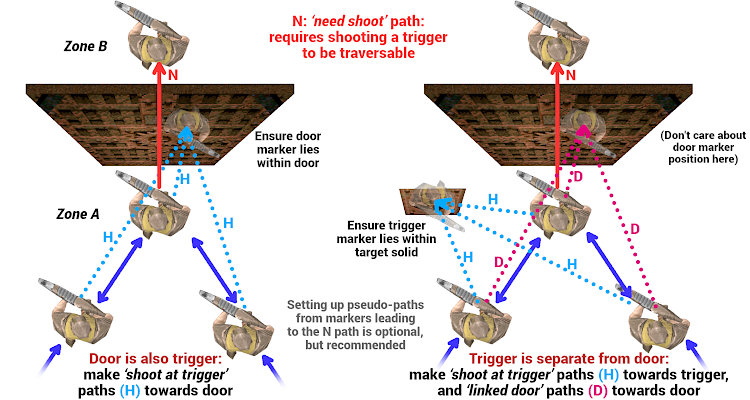
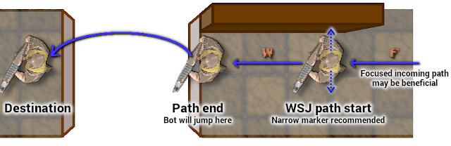
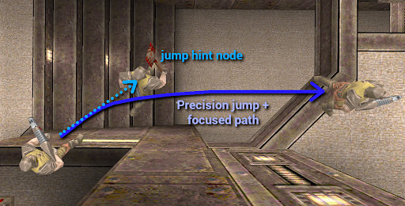
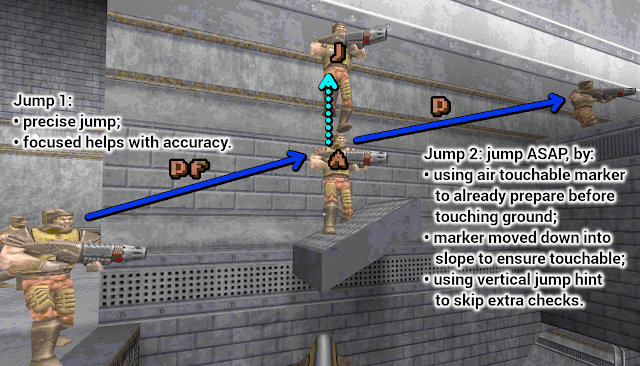

# Quake Frogbot v2 Waypoint Tool

Contents:
- About
- Deploying and Building
- Getting your waypoint data loaded in a Frogbot and/or waypoint build
- Waypoint Creating and Editing Guide


## About

The Quake Frogbot needs _waypoints_ to be able to run around in a map and gib opponents. Waypoints need to be generated for each map, currently this is a manual process (it should in theory be possible to automatically generate sensible waypoints from map geometry, but manual tweaking will always be required for most maps).

The waypoint tool runs inside plain Quake game engines (not QuakeWorld), and allows to create and edit waypoints. It is based on the one that _Mick K_ provided in his [waypoint guide](https://mickkn.mooo.com/quakeworld/frogbot/) (which may or may not be available anymore). It is built from the same source code as the Frogbot, but then with UI code added and some unneeded bits removed.  
The original tool's source code is long lost or at least not easily found, hence it was reconstructed by DrLex through decompiling, and then enhanced for greater usability.

One of the motivations for resurrecting the source code of the waypoint tool, is to allow loading existing waypoint data for a map, such that one can simply continue editing from where one left off. If the tool is built with the waypoint code for that map included, or embedded waypoints are provided in an `.ent` file or baked into the map, then they will be loaded together with the map when executing the `map <mapname>` command.  
Saving work-in-progress, testing it with bots, and then continuing to edit, is the **only** sane workflow to make good waypoints for any map larger than a trivial 1-on-1.

Once waypoints have been created, there are 2 ways to allow Frogbots to use them, or to resume editing existing waypoints. More information is in the section below, but in short:

1. Recompile the Frogbot `qwprogs.dat` and/or `progs.dat` with the waypoint data included in the `maps` source directory. This was the only way of doing it since 1997 before DrLex implemented the next method in 2025 (hey, better late than never…)  
   For truly finalised maps, this remains the preferred method because it provides the best end-user experience.
2. Embed the waypoint data as _entity fields._ These fields all have a `FrB_` prefix. A Python script takes the waypoint dump and injects the data into an `.ent` file, which can then be loaded together with the map by most modern engines. This makes it easy to distribute waypoints with new maps.  
   It is also possible to inject the same data into a `.map` file, which means this method can be used to build a BSP file with embedded waypoints. This may be particularly useful while playtesting a map with bots, because waypoint data in a `.map` file relies on textual IDs, unlike the compiled format from method 1 which relies on indexes that may shift. This makes it much more feasible to edit the `.map` without (totally) breaking the waypoints.

Whatever method is used, the most practical way of producing and editing waypoint data is with this waypoint tool.


## Deploying and Building

There is no strict need to compile the waypoint tool, although being able to will allow for a smoother workflow, see details below. You can already get started with the prebuilt `waypoint/progs.dat` file from the latest bundle available in the Releases section of the GitHub repository, and if you're going to make embedded waypoints, this will be all you need.

In the `waypoint` directory of this repository, you will find an `autoexec.cfg` that sets up similar key bindings as used in Mick's old guide (and a lot more). Create a `waypoint` directory in the same directory where your favourite Quake engine has its `id1` folder. I use _vkQuake,_ but any engine that can run the full single player campaign should work.  
Place both the waypoint `progs.dat` and the `autoexec.cfg` in your Quake engine's `waypoint/` folder.

To run the tool, do `game waypoint` in the Quake console, or select it from the menu, or directly launch it with appropriate command-line arguments for your engine. Then use the `map` command to load a map, and you can start waypointin'.

**Rebuilding the waypoint tool** is required if you:
- want to fix bugs or add functionality;
- want to use the recompiling workflow mentioned above to resume editing work-in-progress waypoints. This is not as scary as it sounds; it is in fact the smoothest way of working with a well-configured workflow.

The waypoint tool is built from the same source code as the regular Frogbot, by enabling different options. See the section below for instructions on how to build it.

Important: the regular build of this tool requires a Quake engine that supports the `stof()` function (#81). Most modern engines like QuakeSpasm or vkQuake are OK. If you badly want to run this in the original Quake, it might be possible by rebuilding the tool with the `VANILLA_QUAKE` macro defined, but this will break the loading of waypoint data embedded as entities in BSP files.


## Getting your waypoint data loaded in a Frogbot and/or waypoint build

The canonical format for waypoint data is the **QuakeC source code dump** that is produced by the waypoint tool. It _is_ a weird format, but it does the job. It is needed as input for both the compiled and embedded workflows.

You do not need to wait with testing waypoints until the whole map is covered. You can already test your first zones, the best way is with the “become Frogbot” feature of the waypoint tool, see the section about this below. Actually playing against bots is only really useful when the waypoints are almost complete.

If you want to include waypoints for a certain map in this repository, create a pull request.

### Obtaining the waypoint dump

To obtain this dump after making changes, press `F1` while in manual mode. It may take a while for everything to be printed to the console—don't do _anything_ until it finishes scrolling.  
Then, you must save the console to a file, unless you launched Quake with `-condebug` (which continuously appends the console to a file). The config provided with the waypoint tool binds `F5` to the `condump` command. Or, use whatever method appropriate for your Quake engine to obtain the console output.

Ensure no unwanted newlines are introduced in the dump: lines must _only_ be split after a `;`.

Find your console dump file (often called `condump.txt`) and extract the entire `void() map_mapname {…};` function from the end. Preferably, include the `MarkerInfo` comment block as well. Save this to a file called `map_mapname.qc`. The `mapname` must be all lowercase, and correspond _exactly_ to the actual map name that will be used for the `map` command.

If the map has `+` or `-` characters in its name, you _must_ edit the `.qc` file and replace these characters in the line starting with `void() map_…`:
- `+` must be replaced with `PLUS`;
- `-` must be replaced with `DASH`.

Instead of doing this manually, it is way easier and safer to use the **getmapdump.py** Python script. It will extract the last waypoint dump from a console file (default `condump.txt`, a different name can be provided as first argument). The dump can be saved directly to a new or existing `.qc` file by passing its path with the `-o` parameter.

```bash
python getmapdump.py -o path_to_your_waypoint_file.qc  # if console dump is in 'condump.txt'
# or, if the console file has a different name:
python getmapdump.py -o path_to_your_waypoint_file.qc console.log
```

You _can_ manually edit the waypoint code, like swapping zone numbers, editing goals, removing unwanted paths or path modes, or fixing other things. The format is straightforward. However, in general it is much saner to do everything inside the waypoint tool.

So, now you have this dump of waypoint code. What to do with it?

### Method 1: Build waypoints into Frogbot/waypoint progs

This is the **classic method,** and is appropriate for maps that are considered _final,_ i.e., their `.bsp` file will remain unchanged until the thermal death of the universe. For maps that may still need to be changed, the embedded method (see below) is much more appropriate.
- The _advantage_ is that everything is bundled inside the single progs files, and the included maps will then be instantly playable by anyone using the latest Frogbot build, without requiring extra files.
- The _disadvantage_ is that if multiple builds of the Frogbot progs would be distributed, it is hard to know what list of maps they support. And also, old builds may contain old waypoints with flaws.
- Another _disadvantage_ is that this workflow is nearly unusable for maps where items still need to be added or removed. Adding or removing a single item can still be patched with the `entity_shifter.py` script, but adding or removing multiple items at once will make things hairy very quickly. Again, the embedded workflow is much more usable in this case.

Add the `map_mapname.qc` file to the `maps` folder of the Frogbot source code, then update the `maplist.txt` file and routines in the source code.  
_Don't do this manually!_ The `generate_maplist.py` script will do everything for you. From inside the `maps` directory, invoke it as follows:
```bash
python generate_maplist.py -vlgt -d drlex ktx trinca other
```

Now you can rebuild the Frogbot `(qw)progs.dat` to test playing against bots (see main README for instructions), and rebuild the waypoint `progs.dat` to continue editing the waypoints (instructions below).

#### About map aliases
If the same map exists under different names, or 2 maps only differ in textures but have otherwise identical geometry and items, then it is possible to mark one map as an _alias_ of the other; this is more efficient than copying the QC files.  
For instance if `tridm1` is the same map as `trindm1`, then it suffices to add the following line to the `map_trindm1.qc` file, and the `generate_maplist.py` script will do the rest:
```
// ALIASES tridm1
```

#### Building the Waypoint Tool
The de facto QuakeC compiler nowadays is [FTEQCC](https://www.fteqcc.org/), no guarantees are given that the code will build with anything else. All instructions below assume you will be using _fteqcc._

Execute from within the `src` directory:
```bash
mkdir -p ../Release/waypoint  # can skip if it already exists
fteqcc.bin -DWAYPOINT_BUILD=1 -O3 -srcfile progs-waypoint.src
```

The output `progs.dat` will be placed in the `Release/waypoint/` folder 1 level up. See the above instructions on how to deploy this.

If you are in a shell environment where _bash_ is available, you can use the `build-waypoint` script from inside the `src` directory instead, or write a similar script for your favourite shell. You can edit this script to also instantly deploy the `progs.dat` and `autoexec.cfg` files to your Quake folder for maximum convenience.

Now you can launch Quake and do `game waypoint`, then `map` followed by the map you want to edit/test.

#### My typical workflow
For creating waypoints for existing finalised maps, I use the compiled workflow because it is the fastest. The following example requires a Unix/Linux-like shell environment.
```bash
# Launch Quake, open console, `game waypoint`, `map themapname`.
# Edit waypoints, dump them (F1) and export the console (F5). Then quit Quake.
# Then, extract waypoint data straight into the appropriate QC file, by running
# the getmapdump script, symlinked in the directory where the Quake console was dumped:
./getmapdump.py -o /path/to/frogbot/src/maps/subdir/map_themapname.qc
# If the .qc file was newly created, then run from inside the src/maps folder:
python generate_maplist.py -vglt -d drlex ktx trinca other
# Then, from inside the main 'src' folder:
./build-waypoint.sh  # while work is in progress; go back to step 1 and loop until ready.
# When waypoints seem ready enough to test in a real game, either:
./build-qwbot.sh
# or:
./build-quakebot.sh  # both scripts edited to immediately deploy the builds.
```
I have edited my build scripts to instantly copy the built files and configs to the Quake folders, such that I can immediately launch the game.


### Method 2: embed waypoints into an `.ent` or `.map` file

This is the **new method,** available since the v2 Frogbot. What this does, is adding extra fields to existing entities, as well as extra `testplayerstart` entities to represent the custom markers. This modified entity list can then be injected into an `.ent` file extracted from the map's `.bsp`. The Frogbot code will then parse the waypoint data from the entity fields.

An obvious advantage is that waypoint data can be distributed with a map, without having to rebuild the waypoint progs. The disadvantage is that the separate `.ent` file may get lost, or conflict with other `.ent` files. In general, you should not load other custom `.ent` files with the Frogbot mod, it is likely to crash the game badly.

Another advantage is that unlike the compiled waypoints that rely on indices, this embedded waypoint data relies on string IDs to describe paths, which keeps them relatively robust against removing or adding extra entities. Of course there are limits: deleting an entity and adding a new one will require repairing paths and possibly also zones and goals. For this reason, it is only really recommended to spend effort on creating waypoints when a map is considered reasonably final and only minor tweaks are expected.

It is also possible to inject the waypoint data into a `.map` file, and then build a BSP from this, which will then effectively have built-in Frogbot v2 support. This is _especially_ useful while developing a map and using Frogbots for initial playtesting, because the waypoint data will be mostly preserved while editing the map in editors like TrenchBroom. You may even edit the custom markers by moving their `testplayerstart` representations.

In theory you could even distribute your final map this way, but mind that this freezes the embedded waypoints to your final version. If you would edit the waypoints and rebuild the map, the BSP will be different, which could cause problems on servers. Moreover, loading the map outside of the Frogbot mod, might spam the console with warnings about the custom entity fields in some cases. I would therefore recommend to either distribute the waypoints in a separate `.ent` file, or have them added as compiled waypoints in the “official” Frogbot builds. The latter 2 options can be edited easily independently of the map file.

#### Workflow
- Extract the entity list from the BSP. There are several tools that can do this, for instance `bsputil` from _ericw-tools:_  
  `bsputil -extract-entities yourmap.ent yourmap.bsp`
- Dump the waypoints to the QuakeC format as described above (`F1`, extract the `qc` source).
- Run the injection script with the 2 files as arguments. By default, it will overwrite the `.ent` file. You can specify a custom output file with the `-o` option.

```bash
python waypoint_map_inject.py -v -w map_mapname.qc mapname.ent
# or
python waypoint_map_inject.py -v -w map_mapname.qc -o mapname.ent mapname-input.ent
```
The script will try to preserve ID strings if an existing `.ent` or `.map` file is given as argument. This is only really important when updating an existing `.map` file after making edits, the IDs should be considered volatile otherwise.

You can now load the map again in your engine with the new/updated `.ent` file next to it, you don't even need to quit and restart.

#### Converting embedded waypoints back to QuakeC code format
Simple: load the map in the waypoint tool, and dump the code with `F1` (and `F5` if needed) as usual.

#### Using embedded waypoints for playtesting a map under development
A usable workflow for using the Frogbot to playtest a map, could look like this:

1. Load your candidate map in the waypoint tool, and set up waypoints.
2. Dump waypoints and extract them from the console.
3. Using `waypoint_map_inject.py`, inject the waypoints from the `.qc` format file into the `.map` file, reload it in your editor, and then build the `.bsp` from this.
4. Test the map. Try different bot skill levels within a reasonable range.
5. Apply any desired changes to the map, starting from the `.map` file with the embedded waypoints. You could edit waypoints within your map editor, by manipulating `testplayerstart` entities, for instance if editing geometry would cause some of those to end up inside walls. However, keep this to a minimum because it will be cumbersome. Fixing the waypoints will be easier in the following steps.
6. Rebuild the `.bsp` from the updated `.map,` and reload it in the waypoint tool.
7. Update the waypoints: fix things broken by changes or that have been added. Check paths, especially if you deleted or moved existing items.
8. Go back to step 2, and loop until satisfied.
9. Unless you really want to keep the waypoints embedded in the BSP forever, you should scrub them from the `.map` file with the `-s` option of the inject script before building the final BSP, and then inject them into an `.ent` file or have them compiled into the Frogbot mod.


# Waypoint Creating and Editing Guide

This is a highly evolved version of Mick's guide, which should now be considered obsolete, although it was a great starting point without which all this stuff would never have existed.

If you want to create waypoints for a map, I advise to first get familiar with that map. Ideally, play the map with human opponents, although you can also learn a lot by observing it being played. In general, making waypoints is also a great way to get to know the map much better.  
The nice thing about the waypoint tool though, is that _it runs inside Quake,_ and one can also explore maps in it, and try out jumps and such.


## How the Frogbot works, in a nutshell

The Frogbot relies on **markers** to navigate the map. Bots can only run or jump from one marker to another in (usually) a straight line. Markers are connected through _paths._ Each time a bot _touches_ a marker, it will select the best outgoing path to reach its current goal.

Markers are automatically generated for several entities in a map:
- deathmatch spawn points;
- weapons, ammo, health packs, armour, etc.;
- teleport triggers and destinations, buttons, doors, platforms, and push triggers.

However, those alone don't suffice. _Extra markers_ must be added to guide the bots past corners, obstacles, etc. Then markers must be divided into **zones,** and the items that can be picked up must be given **goal** numbers to indicate (weak) preference. Last but not least, connections must be created between markers to tell the bot what **paths** can be followed, optionally with special **mode** descriptions for some of those connections. Markers can also have special **types.**

A marker will be _touched_ when the bot comes sufficiently near it, and even if the bot did not plan to reach that marker, it will re-evaluate its trajectory whenever it touches any marker (unless in exclusive mode, as explained in the advanced section). This is important to remember: don't just assume bots will only run between markers that have connections between them. More details in the advanced section.

Markers have an _index:_ the index for `m123` is 123. The lowest indices are used by map entities, followed by custom added markers. (In previous editions of the Frogbot, indices for custom markers could change when loading existing waypoints and then saving them, even when making no changes at all. The v2 waypoint tool has a deterministic way of saving waypoint data and will not only preserve existing indices, it also saves waypoint code in a standard ordering to make it much easier to track changes. When importing waypoints from an older version, data will be reordered, but indices will stay the same.)


## Key bindings

These are the bindings provided by the `autoexec.cfg`. Of course you are free to modify them. Unless your memory is flawless, you will want to print out this list, or have it on a second monitor while running the waypoint tool.
```
KEY     ALTKEY  OLD_IMP NEW_IMP FUNCTION
O               120     131     TOGGLE MANUAL-MODE
MOUSE1  3       119     132     SPAWN A MARKER
G       9       132     142     DEFAULT MARKER-MODE
F       5       135     144     TOGGLE CLOSEST-MARKER-MODE
L       0       -       156     CYCLE BETWEEN 4 CLOSEST MARKERS
I       TAB     127     135     TOGGLE STATIC ACTIVE MARKER
P               128     136     REMOVE ACTIVE MARKER
H               129     137     DISABLE ACTIVE MARKER
J       6       130     138     TOGGLE ONEWAY-MODE
MOUSE2  4       131     139     TOGGLE CONNECT-MARKERS-MODE
K               -       160     AUTO CONNECT trigger_teleport
T               137     145     CLEAR ACTIVE MARKER PATHS
Y               138     146     MOVE ACTIVE MARKER
U               139     147     VERTICALLY MOVE ACTIVE MARKER
E               -       159     MOVE TO ACTIVE MARKER
WHEELUP 2       140     148     INCREASE GOAL/ZONES
WHEELDN 1       141     149     DECREASE GOAL/ZONES
ENTER   Q       142     150     SET GOAL/ZONE
C       8       143     151     PRINT ZONE, GOAL, TYPE
R               -       157     PRINT/SHOW PATHS
V       7       144     152     CYCLE PATH-MODES or
                                CYCLE MARKER TYPES
Z               146     154     CYCLE DISPLAY-MODE
B               145     153     DISPLAY TRAVELTIME
X               147     155     DISPLAY REACHABLE
N               125     133     CHECK ALL GOALS
M               126     134     CHECK ALL ZONES
,               -       161     SHOW SAME OR NEXT GOAL
;               -       164     SHOW NEXT ITEM OF SAME TYPE
.               -       163     SET DOOR OPEN THRESHOLD
/               -       158     PRINT COORDINATES & EXTRA INFO
'               -       165     SET CUSTOM INTERMISSION CAMERA
-               -       166     FORCE NEXT GOAL MARKER(S)
F1              133     143     DUMP WAYPOINT DATA
F2              ?       130     NOCLIP
F3              ?       50      DISABLE DAMAGE FLASH
F4              ?       123     TOGGLE FROGBOT -- CAUTION!
                                Read Advanced section first!
F5              -       -       CONDUMP COMMAND (dump console to file)
MOUSE3          -       -       FIRE
none            -       162     TOGGLE ROCKET JUMPING

PATH MODES
(label - new in v2? - mode)
        regular path mode (default)
        disconnect-mode
J       jump ledge-mode
R       rocket jump mode
PS  y   slow precise jump mode
P   y   precise jump mode
S   y   slow down mode
!   y   just GO mode
=   y   narrow path mode
F   y   focused path mode
W   y   wall strafe jump mode
N   y   need shoot mode
H   y   shoot at trigger (pseudo)
D   y   linked door (pseudo)
    y   clear all assigned path modes
        reversible display-mode
        water path display-mode

MARKER TYPES (when DISPLAY-MODE = TYPE)
        type mode off / clear marker type (default)
U       unreachable node
E   y   exclusive node
L   y   wait lift node
J   y   jump hint node (pseudo)
S   y   slime island node
B   y   want biosuit node
F   y   force node activated
T   y   untouchable node
A   y   air touchable node
D   y   danger node
```

## The workflow

Ensure the map you want to create or edit waypoints for, is in your `id1/maps/` folder. Then Launch Quake. You may want to launch the engine with `-condebug` argument to automatically dump console output. Not essential, but provides a safeguard against unexpected crashes, although the new waypoint tool is more stable than the old one.

In the Quake console, type `game waypoint`. Then load the map with `map <mapname>`. Then you can start making waypoints as explained below.

After loading the map, it looks like you're in a regular Quake game with no opponents and everything made bright and low-contrast to better see what you're doing. To start editing waypoints, you must toggle **manual mode:** press `O`.


**Markers** are represented by the _Quake guy._ Inactive markers have the shotgun, the active marker wields the axe. Rotating markers indicate a relation to the current marker, depending on the current view mode. The default is to show markers to which the active marker has an outgoing path.

By default, the tool will activate markers in the same way as in the game, i.e., when you're close enough to pick up something or trigger an action. Often, it is more convenient to switch to the tool's **Closest-Marker-Mode** with `F`. CMM makes it generally easier to select markers, especially special ones like teleport triggers. When markers are really close to each other or overlap, CMM also allows to cycle between the 4 nearest with the `L` or `0` (zero) key.

### Useful keys for displaying info
- `Z` changes the display mode, which is useful to verify things. For instance path display mode (the default) will make all other markers spin that are part of the active marker's outgoing paths.
- `C` prints information about the active marker, like its number, zone, goal, and coordinates.
- `R` prints outgoing and incoming paths for the active marker, and visualises them through flying spikes.


### Steps
These steps do not need to be done in this exact order, but you will typically gradually move from the top to the bottom of this list as you progress.

1. Use the scroll wheel or keys `1` and `2` to select a **ZONE** number.  
   - **Zones** could be considered parts of the map where everything is within reach without having to cross obstacles or run a long distance. See the guidelines below.  
     Zone numbers do not impose a preference, I usually start with 1 for the “main” zone where most of the action will happen and go up from there, but you can use any number for any part of the map, and you can skip numbers.
   - There can be up to _32 markers_ in one zone. If you exceed this, you must split up zones.

2. Activate the desired marker and set its zone: `ENTER` or `Q`. Do this for all markers you consider the same zone.  
   
   - **Guidelines for assigning markers to zones:**
     1. going from one marker to another within the same zone _must not_ require passing through another zone's markers: moving between markers of the same zone must only involve following paths within the zone;
     2. markers within a zone must be within a reasonably short travel time, no more than a few seconds;
     3. do not create zones that are one elongated chain of markers, split those up into shorter chains;
     4. if going from marker _B_ to _A_ takes much longer than going from _A_ to _B,_ for instance _A→B_ is a simple jump, _B→A_ requires taking staircases, elevators, swimming, … then A and B should probably be in different zones;
     5. _doors_ should usually be treated as zone borders, and secret doors (that need to be shot to open) _must_ separate different zones (see advanced section).
   - Giving each zone a _convex shape_ will ensure most of the above guidelines are satisfied, but it is not a strict requirement. Do expect problems when creating weird intertwined concave zones.

3. Add extra markers where needed for constructing paths such that bots won't get stuck on geometry: move to the spot and `MOUSE1`. Do not overdo this, but don't leave huge gaps between markers either.  
   Remember to also assign a zone to the new markers. If a zone number is currently selected, new markers automatically get this zone.  
   

4. Assign **GOALS** to items: things the bot will want to fetch: weapons, ammo, health, powerups. Use the scroll wheel or keys `1` and `2` to select GOAL number and again use `ENTER` or `Q` on the marker.
   - The goal logic is horribly complicated and hard to understand; what follows is what I have learnt from experiments, Mick's guide, and digging in the source code. If someone has better insights, please update this guide.
   - The bot will have a very _weak_ preference for **lower** goal numbers, making their values more like _suggestions._ The bot has its own logic for preferring items, and only when there is ambiguity between the best scoring items, the one with the lower `G` number will win. For instance, the bot will desire to pick up Red Armour when available. If it is better to first pick up Yellow or even Green armour before chasing the RA, you should give the RA a very high goal, and the other a very low goal, to tweak this preference. Other example: a Mega Health not easily accessible may require a very low goal number to make the bot want to fetch it. It depends on the map layout, and you may need to experiment a bit.
   - Mick recommends **not to reuse the lowest goal numbers,** and this seems generally good advice. I would add that one should especially not give the same low goal number to _different_ weapons or powerups, certainly not when they are in the same zone and _absolutely not_ when they are directly linked. In large maps, _it is OK_ to give items of the same type the same goal across different zones.
   - If health or _same_ ammo items are clustered together with _direct_ paths between each other, then **do** give those same items the same goal number. Also, the larger the cluster of same ammo or health, the more worthwhile it may be, hence may deserve a lower goal number than isolated items of the same kind (but again, goal number preference is weak anyway). But again: _do not_ give different items within the same zone the same goal number.
   - If the total number of items (or item clusters) in a map is small enough that each can have a unique goal number, by all means do so.
   - You will notice that the following items are given high default goals because they are considered less desirable. Of course you can give particular instances of these items (especially the weapons) a different goal if you want:
     * 19 `item_cells`
     * 20 `weapon_supernailgun`
     * 21 `weapon_supershotgun`
     * 22 `weapon_nailgun`
     * 23 `item_spikes`
     * 24 `item_shells`
   - To help with avoiding overlapping goals, the `,` key cycles between items that share the same goal number, when an item with assigned goal is active. Otherwise it prints the lowest unused goal number. The `;` key may also help to loop over items of the same type.
   - It is possible and valid to assign _no goal at all_ to items. This will _not_ make the bot totally ignore them and it may still pick them up when nearby, but it will generally not do any effort to reach the items. This is useful if for instance chasing a particular Quad or invisibility is too risky and makes the bot an easy target.
   - If need be, the desire for goals G1 and G2 _can_ be adjusted, see the Advanced section.

5. Go to another zone and repeat steps 1 to 5.

6. Use `N` and `M` to check whether you didn't forget to set zones and goals (enable NOCLIP for this, `F2`).
   - Using the `C` key on an active marker will show its zone and goal, and some more info.  
   - It is recommended to give everything a zone, even if it will not be used in a path. It is OK to omit goals as explained above.

   

7. **Connect markers:** each marker can have up to 8 outgoing paths the bot may choose from. Normally the tool will create 2-way (bidirectional) paths, unless you enable one-way mode with `J`. Remember that you can use the `R` key to display paths for an active marker.  
   To add a path from marker _x_ to _y_ (and vice versa unless one-way mode):
   - Start at _x_, optionally press `G` to reset marker mode, then `MOUSE2` for Connect Marker Mode (CoMM).
   - The next marker you touch will be linked. If there is any risk of activating the wrong marker on the way, first press `MOUSE2` again to temporarily disable CoMM.
   - Move to marker _y_. If you didn't disable CoMM, the link will be made instantly. Otherwise you again need to `MOUSE2`.
   - Once a path has been added, CoMM disables itself, but marker _x_ remains set as static active marker. You can then either make another path from _x_ to a different marker by moving to it and again using `MOUSE2`; or you can deselect _x_ by pressing `TAB` or `G`.
   - Avoid making paths _towards_ one-way teleport destinations, see remarks below. Same for spawn point markers not worth running towards because they are somewhere in a corner.
   - Ensure every marker that can be reached in any way (even if only by being flung around by an explosion), has at least one outgoing path, otherwise the bot may get stuck on it.
   - Do not make regular paths towards markers high up in the air. See the Troubleshooting section for more details.
   - If you added a path by mistake, you can remove it with _disconnect mode,_ see below.  

   

8. **Teleports:** you must make a one-way connection from each `trigger_teleport` to its corresponding `info_teleport_destination`. This has become a lot easier in the v2 tool.
   - It is _essential_ to first enable both NOCLIP with `F2` and closest-marker mode with `F`.
   - Then move into the teleport trigger zone, and ensure with `C` that the `trigger_teleport` marker is selected.
   - Hit `K`. The trigger now has an outgoing path to its destination (and _only_ its destination, as it should be).  
     
   - If it is a 2-way teleporter, now do the same thing at the other side to connect its trigger to the destination.
   - Teleports are disabled in manual mode, hence toggle with `O` to get teleported to the other side.
   - It doesn't matter whether you assign a `trigger_teleport` the zone it is in, or its destination zone. (I stick with the zone it is in.)
   - The `K` key can also be used on destination markers, in which case it will send you back to one of the triggers that leads to that destination (requires NOCLIP to work reliably).

   Teleport path hygiene:
   - A `trigger_teleport` must only have _incoming_ paths besides its single outgoing destination path (other outgoing paths would be pointless and could mess up path planning).
   - An `info_teleport_destination` of a _1-way teleporter_ should preferably only have _outgoing_ paths besides its single incoming trigger path. Using such markers as part of a regular route, incurs an unnecessary  _telefrag_ risk.  
     For a _2-way teleporter_ however, if the destination marker(s) need to be traversed and will be touched when trying to reach the trigger at that end, then the destination marker _must_ also have a path back to that trigger.
   - Never use destination markers as regular path markers if they are high up in the air and cannot be (easily) touched. Those must only have outgoing paths, which should only go towards the marker(s) very near the point where the bot will end up after being teleported, possibly through an air strafing turn.

9. **Special path modes.** You can apply these while making the paths, or afterwards. The modes for a marker's paths can be seen by pressing the `R` key.  
   Same workflow as above, only now you also have to select the **mode** with `V` before making the connection (not all are path modes, some affect display mode). Most of these require _one-way mode_ to be enabled (`J` key); only disconnect mode can also work bidirectionally.
   - **Disconnect mode**: removes a path. If one-way mode is enabled, it will only disconnect the path from the starting marker _x_ to target _y_. Otherwise it will also disconnect any path from _y_ to _x._
   - **Jump ledge** (shown as `‘J’`, number 1024 in code) is to explicitly mark the path as a “jump,” usually to _get up onto ledges,_ but also to _jump down._ The usefulness of this mode has become limited when it comes to ensuring that the bot will jump when needed. In most cases this is automatic, the bot can figure out by itself when it needs to jump to cross a gap. Only paths going up a step taller than 18 units, _must_ be marked with this mode (or precise jump mode) to ensure the bot will jump onto the step.  
     Marking downward jumps/falls with _jump ledge_ mode may also be useful to ensure the bot considers it a jump and will not react to nearby markers while in the air, and also to encourage it to aim for the destination marker.  
     _Never_ set this mode on a path starting inside liquids too deep for jumping, it may have ill side effects.
   - **Rocket jump mode** (shown as `‘R’`, number 512 in code) is to make the bot consider a RJ from that place to the destination. It will only do this if the conditions are right, and will also add a coin flip to the decision, so don't expect the bot to RJ all the time. See the advanced section below for some tips.
   - **Slow precise jump mode** (shown as `‘PS’`, number 2176 in code) is actually a combination of the next 2 modes, provided for convenience because often you will need them together. This combined mode allows to _navigate small steps_ like the ones towards the yellow armour in `e1m2`. The bot _will not jump_ until it is within a distance of _40 units_ of the marker from which this `PS` path originates. This means you must place such markers close enough to the ledge on which the bot needs to jump, otherwise it will not jump at the right moment, and get stuck.  
     You may not need this often, but without it, getting onto certain small steps is often near impossible because the bot moves too erratically when trying to use ledge jump mode.  
     
   - **Precise jump mode** (shown as `‘P’`, number 128 in code) will make the bot do extra effort to initiate a jump closer from the location of the marker where this path originates, and also to better aim in the direction of the destination marker. This can be used for tricky jumps that require accuracy, because normal bot movement is rather _sloppy._  
     Again, the bot will only jump within a distance of 40 units of the start marker. To make this work well, provide a single path towards the jump spot in such a way that the bot is already moving roughly in the right direction when it reaches the marker from where to jump. Otherwise the bot will perform an extra manoeuvre to do a proper run-up (which can fail if there is not enough room).  
     A precise jump can be further tuned with a `jump hint` marker, see the Advanced section.
   - **Slow down mode** (shown as `‘S’`, number 2048 in code) will make the bot slow down while near the marker from which this path starts. It is mostly useful to combine with precise jump, but can also be used alone or in combination with just GO mode, to avoid that the bot overshoots its target when making a deep downward jump.
   - **Just GO mode** (shown as `‘!’`, number 1 in code) does what it says: it disables all safety checks in the bot for that path, and just makes it _go._ The most common use case is to override the bot's fall-from-edges mechanism, which sometimes engages inadvertently and prevents the bot from jumping off a ledge. If you see the bot zig-zagging across an edge while it should just jump down, try adding this path mode.  
     A less common use case is to force the bot to traverse a short bit of lava, which it may otherwise refuse if there is no obvious spot to jump to.  
     In `lilith` you will find examples of both these cases at the 2 teleports in the map's corners.
   - **Narrow path mode** (shown as `‘=’`, number 32 in code) makes the bot do effort to align itself to this path before proceeding, this is useful to get through narrow openings or walk/climb on narrow structures like ladders. See the Advanced section for details.
   - **Focused path mode** (shown as `‘F’`, number 2 in code) makes the bot look at (focus on) the destination marker of the path. It is recommended to set this on every path where the bot has to jump out of water (example in `cmt4`). It is also useful for walking along tricky thin ledges (example in `tox`). It may also help to make certain jumps more reliable (example in `aerowalk`). Without this mode, the bot may be distracted by looking at the next item it wants to pick up, causing it to move inaccurately and face the wrong way to perform the water jump, or fall off the ledge. (Looking at enemies always has priority over this path mode.)
   - **Wall strafe jump mode** (shown as `‘W’`, number 8 in code) exploits Quake's weird physics to allow bots to jump across gaps too wide for a normal jump in some situations. More info in the advanced section below.
   - **Need shoot mode** (shown as `‘N’`, number 256 in code) is for paths that require shooting a trigger to be traversable, often a door like in _dm6,_ but the trigger may also be separate from the door. More details in the advanced section below.
   - **Shoot at** (shown as `‘h’`, number 32 in code) is a _pseudo path_ mode that indicates what object to shoot for _need shoot_ mode. See the advanced section for more info.
   - **Linked door** (shown as `‘d’`, number 4 in code) is a _pseudo path_ mode that can be combined with _exclusive markers_ or with _need shoot_ mode. See the advanced section for more info.

The path mode selection also affects the display of markers connected to the active marker: when a certain mode is selected, only markers connected through an outgoing path of that type will be shown spinning. (The selection contains 2 pure `display-modes` for certain auto-assigned path types, these cannot be set.)  
Specific modes cannot be individually removed from a path, the only way to remove a path mode is with the `clear all assigned path modes` option, and then reassigning any desired modes. One-way mode is not required for this `clear` operation, but it does only remove modes in 1 direction.

At regular moments, and especially when you're done, use `F1` to dump the waypoint code to console. If you didn't run with `-condebug`, you must then use `condump` to write the console log to a file. The `autoexec` binds this to `F5` (think QuickSave).

### General Remarks
- Guideline 1 for assigning markers to zones is really important; if violated, path planning may not work as expected. For instance, if `m42` is in `Z1` and `m43` is in `Z2`, and you want to add a marker that is _only_ connected to `m43`, not to `m42` nor any other `Z1` marker, then this new marker _must_ be in `Z2`, _not_ in `Z1`.  
  
- Although _Closest-Marker-Mode_ (`F` key) makes it easier to select markers, you should disable it from time to time to ensure you are not creating paths towards markers that cannot be touched in the actual game. If a marker is floating up in the air, which is often the case for teleport destinations, check whether it activates when approaching it with CMM disabled. If not (immediately), do not create paths towards it. (You may and probably should create outgoing paths, just in case the marker does get activated.)
- Remember that bots will react to _any_ marker they ‘touch,’ not only the next one on their path (unless they are in exclusive mode).  
  Also, the touch mechanism is pretty _coarse._ When running between 2 markers that are not extremely far away from each other, the target marker will usually already be touched at the half-way point. The bot will then stop moving towards that marker and change its direction towards the next planned marker. This can make it seem as if the bot is cutting corners on paths with sharp angles. When it is important for the bot to follow a specific curve, you may need to place extra markers, or move markers farther away from obstacles to keep the bot from bumping into them.
- You can ‘lock’ the active marker in Static Marker mode with `I` or `TAB`, allowing to move to other markers without activating them. It is also useful to watch the paths animation (`R`) from a distance, or check how far you are from the marker with the `/` key.
- The `;` key behaves differently when a regular marker is active, in that case it will move to some marker of the currently selected goal or zone number. This allows to quickly jump to a specific zone, or (together with the `,` key) find out which items have a specific goal number.
- It helps to draw a floor plan of the map with zones, goals and paths, especially for complicated cases like exclusive paths, although the visualisation modes of the tool make it easy to spot mistakes. It also is interesting to walk around in existing maps and see how waypoints were added.
- At any time when you are confused about what marker mode you're in, press `G` to reset. (The only thing this does not reset, is closest marker mode.)
- Moving an existing marker is preferable over deleting it and making a new one. Static marker mode (`I` or `TAB`) is your friend here.
- Clearing all marker paths with `T` will only clear outgoing paths in one-way mode, otherwise both outgoing and incoming paths.
- Paths through _push zones_ must be _one-way_ for obvious reasons. The old Frogbot did not create markers for push brushes, but the v2 Frogbot does. Some maps have push zones consisting of multiple segments, meaning there will be multiple markers. In that case you should not connect all those markers, it suffices to make a path to the first `trigger_push` marker, and then a path from that marker to the exit. Any `trigger_push` markers on the way can be left unconnected and should be given `untouchable` marker type. Also, vertically move the first push marker such that it is at the same height as the floor. See `aerowalk` for an example.
- Moving markers vertically (`U`) can also be used on `func_button, teleport_trigger, trigger_push, trigger_multiple,` and `door` markers, but not on other non-manually created markers like weapons.
- It is possible to apply multiple modes to a path, but some combinations make no sense.
- The Frogbot can exploit Quake engine tricks like real players (strafe + turn) to change direction while in the air. This means you may create jumps that rely on such tricks, but make sure to verify they work with an acceptable success rate. More details in the _advanced_ section.
- Goal assignments will be omitted from waypoint data if they do not deviate from the default. Therefore you will never see `G23(m42)` in the waypoint dump if `m42` is a box of spikes.
- Items of the same type will only be treated as a cluster if they are directly connected. Some maps place a weapon in between 2 ammo packs, or an item in between 2 health packs. In such cases, either add direct paths between the same-type items, or give them a different goal number.
- I don't really know the purpose of the _‘display reachable’_ tool. It requires static active marker mode (`I` or `TAB`), and will try to trace a path towards the first marker you're ‘touching’ after activating this mode. It will fail if there is an obstacle, or the distance is “too far,” whatever that means.  
  It has nothing to do with unreachable marker flag (see advanced section).  
  Although markers can be placed further apart than what this tool considers too far, it is still a good guideline for maximum marker distance.
- Same for the _runaway_ thing: I don't know what it's for, aside from a vague hunch that it may be for avoiding enemies that have the pentagram. The information printed on the second and third lines when pressing `C` is related to this ‘runaway’ concept, and the markers shown in runaway mode are the same ones listed in those lines. This appears to be an unfinished feature, there is some logic in the code to do something special when the bot is in `RUNAWAY` state, but _nothing_ in the code sets this state. I might look into this someday… If anyone knows more about it, please explain!

### Troubleshooting
- If you notice the bot going nowhere, randomly moving around while looking at the ceiling or floor, or running into a wall, most likely a nearby marker has an invalid path towards a marker in another room. Check paths with the `R` key, and delete invalid paths in both directions if they go through walls, ceilings or floors.
  - This may also be caused by a marker at the other side of a wall being touched, because walls are transparent to the touch mechanism. Place enough markers at both sides of thin walls, using the wall as a mirror for marker positions.
  - Another possibility is that a zone is too large or scattered. Ensure zones consist of markers clustered together, and that each marker within a zone can be reached from every other marker in that zone without having to exit the zone.
- If the bot keeps _‘orbiting’_ around a marker, most likely it is waiting in vain for the marker to be touched. Usually this happens with markers that float up in the air, often teleport destinations or `info_player_deathmatch` spawn points. Check that markers are easily touchable by disabling closest marker mode (`F`). Do not make paths towards such untouchable markers. Only give them outgoing paths for the cases where they do get touched. (Of course a teleport destination always needs an incoming path from its teleport trigger.)


## Advanced

### Unreachable and untouchable markers

This is optional, but can prevent the bot from getting stuck or doing certain dumb things. Markers can be flagged as being **unreachable,** which means the bot should avoid getting near them. Bots will avoid making jumps that end up near an unreachable marker. The bot will also totally ignore items flagged as unreachable, no matter how juicy they may seem.

To set a marker as unreachable: set display mode `Z` to “Display type,” and use `V` to select `unreachable node`. Then activate the marker and right-click (`MOUSE2`).

If there are lava or slime pits, or deadly traps, it is a good idea to place some unreachable markers in them. Look at `dm4`, `start`, or `tox` for examples. The markers should have some zone number, but do not need to have paths. If however there is a way out of the trap, by all means add an exit route.  
In **lava pits** shallow enough to allow jumping, you may add rocket-jump paths to give the bot a better chance of escaping. If the pit is too deep for jumping, making outgoing paths is generally useless and could interfere with the bot's emergency escape mechanism, which will attempt to rocket-jump towards a nearby safe marker. You can add one-way paths as hints for the best spot to aim for, but such paths should not have any special mode assigned to them.

There is also an **untouchable** marker type. When set, the marker will never produce a touch event. As mentioned above, it is recommended to set this on intermediate `trigger_push` markers. It can also be used on markers that overlap with other markers and are redundant. For instance if an `info_player_deathmatch` is on top of an item marker, it makes sense to just disable touch on the spawn marker and only use the item for paths.  
In general it is also recommended to make `trigger_multiple` markers untouchable, to ensure they do not interfere with paths. Usually these triggers will be activated anyway at the right moment when the bot follows a trajectory that goes through them, and making them an explicit part of the path offers no benefits. Only if a `trigger_multiple` is an essential part of a path, like acting as a lift button, must it be touchable.

_Be careful:_ an untouchable marker must never have incoming paths, or the bot may orbit around it waiting for a touch that never comes. (It makes no sense either to give it outgoing paths, but that is merely pointless instead of dangerous). Errors will be printed in the `MarkerInfo` section of the waypoint dump when paths towards untouchable markers are detected.  
The waypoint tool will also ignore untouchable markers unless closest-marker-mode (`F`) is active. This helps to connect paths to the other overlapping marker (and makes it more obvious when a marker is untouchable).

Mind that when a bot has deliberately become airborne, like when jumping up (or down from a ledge), or getting propelled by a `trigger_push,` it will ignore any marker touches until it has again touched solid ground. There are some exceptions to this:
- pushing a switch will always trigger a touch for that switch's marker (unless made untouchable). This allows to push switches by jumping;
- markers that have been given the `air touchable` node type will always be touched by airborne bots. (The need for this should be very rare.)


### Lifts/elevators with or without buttons

**Automatic lifts/platforms** that go up as soon as a player walks on them, are simple to set up: connect markers to the platform, and then connect the platform marker to the destination. Often the latter should be a one-way path, if there is no easy way to jump down from the raised platform.

By default, the bot will not go towards such platforms when they are not in their ‘down’ position, and may try to find another path. If you want the bot to always wait for the platform if it is the best path to take, or you notice that the bot often gets crushed under the platform while in vain trying to find an alternative path, set `wait lift` marker mode on the platform marker. To do this, set display mode `Z` to “Display type,” and use `V` to select `wait lift node`. Then activate the marker and right-click (`MOUSE2`).

The `wait lift` mode will make the bot wait at any marker that has a path towards the platform, if the platform is the most desirable path, but is not in the downmost position. If this is not desirable for a specific path, set `just GO` mode on the path, and the bot will ignore any dangers as usual. Also, make sure that the waiting spots are sufficiently far away from the platform, or the bot may still get _juiced._

Note that all door-and-lift-like things are treated *equal.* There may be cases where the bot has to walk towards a door that will open automatically, but the test for platform-like things not being in the downmost position causes the bot to refuse to walk towards this door. The solution here is to set `just GO` mode on that path. An example can be found in the map `skull`.

Maps often feature lifts that require a **button press.** This is a bit more complicated to set up, make sure to look at the illustration:
1. make _one-way_ path(s) from outside the lift (_mIn_ in the image) directly to the button (_mBtn_ in the image; do _not_ link to the platform);
2. then make a one-way path from the button to the platform marker (_mPlat_);
3. then make one-way path(s) from the platform to the destination(s) (_mDest_).
4. if `wait lift` mode is required, it must be set on the **button marker,** not on the platform. In most cases this should be done for this type of lift, because there is no default avoidance logic at all for these.


The image shows optional extra paths in dotted lines: you may want to allow the bot to jump down the ‘elevator shaft’ by making the path between platform and destination 2-way, and provide an extra 1-way path from the platform to outside.

Some lifts rely on a `trigger_multiple` instead of a button, all the above applies as well in this case—just treat the trigger marker as the button.

_Multi-floor_ elevators are possible when providing paths from the platform to multiple markers, although whether the bot will actually be able to get off at intermediate floors, may depend on map design. See the `oktest` map for an example of a multi-floor elevator (the bot will jump off half-way through if it wants the mega-health).

Remember that selecting platform and button markers will only be feasible in closest-marker mode (`F`), possibly with `NOCLIP` enabled (`F2`). Double-check that you connected what you intended.


### Exclusive Markers

Exclusive markers are useful in situations where touching other markers is undesirable until the bot has reached a certain location or performed a certain task.

There may be situations where you want the bot to focus on exclusively following a specific path. For instance, after touching a _switch_ to open a door, the bot has to run from the switch to the door while ignoring any markers not part of this path. The bot must also not react to touching any marker on this path towards the door _unless_ when coming from the switch.  
An essential part of making the bot push the switch to open the door, is ensuring that the only path going to the door is a _one-way path_ via the switch. If the path from the switch to the door is well-separated from other paths, this is all that is required. Making a path through a switch, means the bot must push the switch before moving to the next marker in the path.


In a map like `dm5` however, this does not suffice because the paths going to and coming from the switch share the same narrow bridge. Normal bot behaviour is to touch every marker and re-evaluate paths each time a marker is touched. If we would simply create a loop with 2 one-way paths, then when running towards the switch and touching a marker on the return path, the only allowed path is back and vice versa. In other words, the bot would keep yo-yoing between markers from both paths, and go nowhere.  
Also, if the door is already open, we don't want the bot to make the detour via the switch.

The v2 Frogbot offers a solution for this scenario, consisting of 2 parts:
1. **Exclusive node** marker type.  
   Set this on the markers of the one-way path going from the switch to the door. As with the other node types, set display mode `Z` to “Display type,” and use `V` to select `exclusive node`. Then activate the marker and right-click (`MOUSE2`).
2. **Linked door** pseudo-path mode.  
   Connect a `linked door` path from the exclusive markers nearest to the door, towards the door's marker (or one of them, if there are multiple). As often, `NOCLIP` and closest marker mode are your friends here because the door marker will likely be inside a wall. Only do this for the exclusive markers closest to the door—if the bot is near the switch anyway, it is better to again go push it.

This works as follows. The bot will:
- ignore touching an `exclusive node` marker, _unless:_
  - when coming from another marker, following a path that has this exclusive node as its destination;
  - when this node has a `linked door` pseudo-path towards a door marker, and that door is currently open;
- ignore _all_ other markers except the `exclusive node` as soon as it starts following a path towards this node. Because of risk of forever getting stuck, there is a deadline of _3 seconds_ to reach the exclusive node, the bot will resume its usual business if this deadline expires.


If you look at the `dm5` waypoints or the above diagram, you will notice that 2 extra exclusive markers with `linked door` have been placed to make bots approaching from other directions immediately go through the door when someone else has opened it for them. Same for `ultrav`.  
When adding such exclusive markers with `linked door,` it is important to provide **outgoing paths** from those markers towards nearby normal markers, to allow the bot to continue on its path when it touches such an EM while it has no intention of going through the door. If you forget to do this, you may see the bot attempting to exit the exclusive zone and then being “sucked back in” and being unable to exit the area. Again, see `dm5` as example.  
To reduce work-in-progress clutter, it is recommended to first set up, test, and tweak only the setup needed to enter and exit the special zone. Only when everything looks good, add the extra outgoing paths on markers that have a linked door, to prevent bots from inadvertently being sucked into the zone when they merely wanted to continue on their path.

This is a complicated thing to set up, and it must be double-checked and tested for mistakes, but the end result is well worth it. It helps a lot to draw a diagram of the markers and how they must be set up, as in the example above.

Mind that a _platform_ is also considered a _door,_ considered ‘open’ in its ‘up’ position, which means that an exclusive marker can also be linked to a platform with _exclusive door_ mode to activate the marker only when the platform is up. This could for instance be used to make the bot move away from under an extended platform, although the `wait lift` mechanism usually suffices for this.


### Reliable rocket jumps

The v2 Frogbot has _3_ rocket jump modes:
1. The **regular** RJ mode requires the bot to be running towards the launch spot, and it will then launch a rocket at its feet while jumping, when sufficiently close to the spot and more or less heading in the right direction. This is not very accurate, but it is _fast,_ which makes it the preferred mode when possible. Usually the bot is able to correct for errors through air turning tricks, but it will occasionally fail, which makes it all the more realistic.
2. When combining RJ with either slow down or precision jump path modes, the bot will follow a slower but much more **accurate** procedure. It will come to a halt and only launch itself when both at near-ideal position and angles, and will from then on purely ‘drift:’ it will not try to correct mid-air.  
   Only use these modes when truly needed, because the chance that the bot can execute them diminishes when there are more enemies that can distract the bot.  
   There are 2 variants:
   - **‘Mortar’** = `RJ` + `slow down` path modes combined, shown as `RS` in the path display. As the name implies, this will launch the bot like a mortar in a parabolic trajectory, optimising for maximum distance. This mode allows to reach the highest elevations, 240 units is about the maximum although 256 might be achieved in ideal circumstances, but don't count on it.
   - **‘Cannon’** = `RJ` + `precise jump` path modes combined, shown as `RP` in the path display. This will indeed launch the bot more like a cannon with direct aim towards the destination, compensating for vertical drop. This does not allow to go as far as the running or mortar jumps, but can be required for really tricky jumps where accuracy is essential or when a low ceiling does not allow for a full parabolic trajectory.

Bots at higher skill levels will be quicker and more accurate while preparing accurate rocket jumps.

For some accurate jumps, the fact that the bot will passively ‘drift’ may cause problems. If the bot collides with a wall before reaching the destination ledge, it may end up moving purely vertically and never get on the ledge. The simplest solution in this case is to place an _air touchable_ marker near the apex of the jump, with a one-way path towards the destination marker. The bot will resume actively steering towards the ledge when touching this extra marker.

Beware that the bot's pitch angle for these jumps is limited to 78.75 degrees, because this limit is usually imposed by QuakeWorld servers. In other words, _the bot cannot (rocket-)jump up perfectly vertically._ Some error _is_ allowed while preparing for the jump, and the smallest margin is 1.5° for a level 20 bot. This means one must not set up an accurate RJ that requires a pitch angle larger than 80°, because the bot will in vain try to achieve the impossible pitch. When debug logging is enabled while loading the map, a warning message will appear if this situation occurs. In that case:
- try using a cannon instead of mortar type jump; and/or:
- move either the jumping spot marker or the destination marker (or both) to reduce the pitch angle.

Rocket jumps can be _tricky,_ especially when the destination is a ledge that sticks out. If you notice that bots often smack their head against the bottom of the ledge, it usually means the target marker is too deep into the ledge. In that case, it helps to move the marker, or place an extra marker just on the edge of the ledge, perhaps even slightly above it, to improve the bot's aim. Only make that marker the destination for the rocket jump path, and give it a path to the actual destination on the ledge.


For the regular running RJ type: when possible, try to provide only 1 incoming path into the marker from where such RJ should happen, in more or less the correct direction for the jump. This is not essential, but can help with accuracy and reliability of the jumps.

Even when their extra accuracy is not needed, the _mortar_ and _cannon_ modes have the advantage that the bot will come to a halt and be standing on solid ground. This makes these jumps a solution when they have to be performed on a staircase or similar structure, where players will actually be prevented from instantly jumping while moving because they are in a ‘falling’ state most of the time. An example is the jump towards the red armour in `aerowalk`.

It is possible to override pitch and yaw angles for the regular type of RJ at the moment of the jump. This is sort of a _hack,_ and should _not_ be used to allow the bots to make jumps that are near impossible for human players. To keep things fair for novice players, bots will only perform jumps that have this kind of override at skill level 5 or higher.  
This needs to be done manually in the waypoint code itself by setting the `rj_angles` property on the marker from where the RJ starts. The value must be a vector `'pitch yaw 0'`, with yaw between -180 and 180, and pitch cannot exceed 78.75 degrees.  
For instance if `m42` has an outgoing RJ path that requires a pitch of 70 degrees and a yaw of -64 degrees, this line should be added to the waypoint code:
```
m42.rj_angles='70 -64 0';
```

Mind that there are subtle differences between Quake and QuakeWorld physics, which can cause a jump that works in one engine to fail in the other. Do not create set-ups that are borderline, and verify that the jumps do work in the intended engine, preferably in both.

Bots will only actively plan an RJ when that path is worth following to reach a goal, and there is no alternative path that does not require RJ, even if much longer. In the latter case they may randomly decide to take an RJ shortcut when happening to pass across the marker, but they will not actively seek out that path.


### Water

The Frogbot uses different logic to navigate underwater due to the ability to move in 3 dimensions. There are additional checks on reachability of destinations. Make sure that connected markers are within visible range and are not obscured by corners or other obstacles. There is robustness against minor obstacles, but don't expect the bot to find its way through a maze with sparsely provided waypoints.

Useful to know is that markers will no longer be touched when they are at least _57 units_ below the player. This way, markers can be placed in liquids near solid ground markers, when it is important that those liquid markers are not touched while walking on the surface.


### Slime and Lava

With the old Frogbot, making paths through _slime_ or _lava_ was a no-go. Unaware of the danger, the bots would happily swim in the slime or lava and get killed. The v2 Frogbot is smarter and will avoid paths through slime, but _only_ if the map contains a biosuit or invulnerability power-up. Likewise, it will avoid paths through lava if the map has a pentagram. If a bot then picks up one of those items that protects against the hazard, the slime/lava paths will be treated like normal paths and the bot may traverse them to reach something worthwhile.  
Therefore:
- in maps with a biosuit and/or pentagram of protection, it is OK to create paths through slime if it makes any sense;
- in maps with a pentagram, it is OK to create paths through lava;
- in maps that do not have those items, do not create paths through slime/lava unless they're very short.

There are 2 new _marker types_ related to this feature, that can be assigned by changing display mode to `type` with the `Z` key, then selecting the mode with the `V` key, and right-clicking the marker:
1. **slime island:** if there are markers on dry zones or islands that can only be _exited_ through slime, it is important to set this type on all markers on that ‘island.’ This will allow the bot to consider jumping into the slime and having a chance of escaping even when its protection has run out; otherwise it would become a sitting duck on the island.  
If there are _teleport triggers_ or _destinations_ in slime, or that will drop the player into slime, you _must_ also mark these as `slime island` for the path calculations to work correctly, because the game is unable to reliably detect that such markers are inside slime.  
Display mode can be set to `biohazard` with the `Z` key to see which markers are currently considered to be inside slime, or have been given a `slime island` flag. This can be helpful to see whether you still need to set this flag on certain markers.
2. **want biosuit:** this should be set on every worthwhile item that requires the biosuit to be safely reached. This will make the suit as desirable to the bot as the most desirable item marked as such. If there is no marker of this type, the suit will have zero desirability and the bot will only pick it up by chance.

There are no lava equivalents of those marker types, because:
- lava is much more lethal than slime, hence when running out of protection, the bot is better off staying on a lava island and being shot by another player, than to get a penalty for a likely suicide;
- the pentagram is one of the most desirable items for bots anyway.

When making _zones,_ give markers in slime or lava their own zone(s). Do not mix ‘dry’ markers and lava or slime (island) markers in a single zone.

Look at `efdm13` for an example.

Be aware that some maps have lava that looks like slime—if it kills within seconds, it is lava.


### Ladders, narrow paths

Some maps simulate _ladders_ by means of what is basically the steepest possible staircase in a Quake map, with extremely thin steps, typically only 1 unit deep. (Usually the actual staircase is an invisible layer on top of a ladder texture or decorative geometry.) The old Frogbot was unable to ascend these, but this has been fixed in v2. It should suffice to place one marker at the bottom of the ‘ladder’, one at the top, connect them, and the bot will climb up the ladder like a human player. (This may still fail if the map does not adhere to the best practice of using integer coordinates for all vertices.)

If the bot can approach the ladder from its sides, just placing a marker in front of it and connecting it to the top marker, may be problematic. Due to the coarseness of the touch mechanism, the lower marker may already be touched long before the bot is truly in front of the ladder. The bot will then already try to aim for the top of the ladder, fruitlessly attempting to climb up the wall.

The most practical solution in cases like these where the bot must first ensure to come very close to a marker before proceeding on a certain path, is to assign `narrow` mode to that path, in this case the path going up the ladder. As usual, set one-way path mode with the `J` key, then select this mode with the `V` key, and right-click the marker. For additional accuracy, you can add _slow_ mode to this path.


`Narrow` path mode is not only useful for ladders, it can also help to guide the bot through narrow openings or ensure it is in the right position to start walking across a narrow beam. Do not place the starting point of the narrow path inside the door or on top of the narrow beam: place it slightly before, such that the bot is aligned _before_ navigating the obstacle.  
However, don't use this mode unnecessarily, because it can cause the bot to slow down to satisfy the proximity requirement. To reduce the risk of the bot slowing down, try to encourage the bot to already be aligned to the narrow path before it touches the marker.  
Also, narrow paths are useless under water, where the swimming logic handles obstacles.


### Shootable doors and triggers

The old Frogbot supported one single shootable trigger, the door in `dm6`. Even though the logic could be ported to other maps with similar doors, it was very constrained and hard to set up. The bot could open the door only in one direction, and only if it desired to pick up a certain thing behind the door. If the door closed before the bot could get out and the area had no other exit, it got stuck.

The v2 Frogbot replaces this system with _universal shootable triggers._ Bots can now shoot any trigger, be it a door or (secret) switch, whenever they want to cross a path that requires it, in any direction. And remember: anything platform-like is considered a ‘door,’ so this can also be used for bridges etc.

The system relies on multiple path modes, some of which are ‘pseudo’ paths, i.e., they are not actual paths but indicate a relation between markers.
- `need shoot` path mode must be set on a path that can only be crossed after a trigger has been shot.  
  For instance, in `dm6`, any paths going through the large door must have this mode. Although this mode typically has to be set on the path going through the obstacle, it may also be set on an earlier path that is then connected to the obstacle via exclusive markers. An example of the latter can be found in the water zone of `eodm3`.
- `shoot at trigger` pseudo path mode _must_ originate from the same marker from where a `need shoot` path starts.  
  This pseudo path must end at the object to be shot in order to make the `need shoot` path traversable. In `dm6`, it is the door itself, but it may also be a switch controlling a door.  
- `linked door` pseudo path mode is optional, it is needed if the door to be opened is different from the trigger to be shot. If both are the same, it suffices to only create a `shoot at trigger` path towards the door.
- The pseudo paths may also be set on markers that have a direct path towards the marker from where a `need shoot` path starts. This is optional, but recommended because it allows the bot to already prepare for the shot before it reaches the actual waiting spot. (Do not set these paths on even earlier markers, it may have unwanted effects.)
- For the system to work optimally, both ends of the `need shoot` path must be in different zones.

The following image illustrates both a shootable door, and a door that has to be opened by shooting some other target. (Only the path in 1 direction is shown, the same setup has to be made a second time if the door can be opened from either side.)



**Vertical placement** of the marker representing the target to be shot is important. One can consider the _crotch_ of the marker as the point the bot will aim for. By default, markers are placed on top of their door, and it will be necessary to move them downwards to ensure the door itself is hit by the shots. Enable closest-marker mode (`F`) and NOCLIP (`F2`), and use the `U` key while the marker is selected to move it vertically such that the marker's crotch falls within the door volume. For very small targets, like some small switches, some trial-and-error may be required.

#### Setting optimal open door distance
By default, the bot will wait until the door or platform has moved within 10 units of its final ‘open’ position, which in practice means “open all the way.” This also applies to linked doors for exclusive markers.  
In some cases, this is overly conservative, and the bot can already traverse a partially open door. This threshold can be adjusted by setting the `d_door_open` property on the door marker. If a custom value is set, it will be shown as `d_d_o` in the marker info for the door (when using the `C` key).

To set this value from within the waypoint tool, select the door marker (closest-marker mode `F` and NOCLIP `F2` will be helpful), and enable static active marker mode (`TAB` or `I`) to keep it selected even when moving around. Then exit manual mode (`O`), shoot the trigger to open the door (middle mouse button), and quickly re-enter manual mode. Then press the `.` (period) key right at the moment you consider the door open enough for the bot to walk through. (If the door moves too fast for this, you shouldn't even bother, then there is no advantage in setting an exact threshold anyway.)

You should test this using the ‘become Frogbot’ feature (see below), and adjust if needed. The value can be manually tweaked in the waypoint code (look for “`d_door_open=`”). The smallest custom value that can be used, is 1 (but should never be needed), because a value of 0 is treated the same as the default of 10.


### Wall strafe jump

Seasoned players will know that the Quake engine has some weird physics quirks that can be exploited to achieve speeds higher than the typical 320 units/sec limit. One of these tricks is to run along a wall while pressing both forward and strafe keys, and maintaining a certain angle relative to the wall. Although it makes no sense from a real physics point-of-view, running into the wall like this will provide a boost that can reach speeds up to a whopping _480 units/sec,_ which may be useful to cross gaps that are otherwise too wide for a jump.

Waypoints can be set up to rely on this trick by setting _wall strafe jump_ path mode. This requires a sufficiently long wall parallel to the jump direction, and extending at least up to the point from where to jump. The bot will determine whether it needs to strafe left or right by probing for the nearest wall at the marker where this path starts. It will then run across the path while simultaneously strafing, using the path's direction to determine the optimal angle. When it reaches the marker at the end of the WSJ path, it will jump.



Some hints to improve chances of this working:
- The path must be parallel to the wall. The simplest way to ensure this, is to place both markers right against the wall.
- Place the end marker right on the edge from where to jump, to maximize the distance that can be bridged. This marker should only have 1 incoming and 1 outgoing path, and should be made _exclusive_ if there is any risk of touching it while not wall strafing.
- If the available wall segment is short, also assign `narrow` mode to the path to make the bot come closer to the start point and get the most from the limited space.
- It may also help to set _focused path mode_ on the path leading to the start marker, to ensure the bot is already looking mostly in the right direction at the start of the path. Slow path mode may help to give the bot more time to adjust its aim.

Look at `catalyst` (jump towards mega health) for an example.

Bots at lower skill levels will execute this procedure more sloppily and have a higher risk of the jump failing.

If no wall can be probed nearby the starting point of the path, the bot will run straight along the path and jump at the end, without speed boost. This could be an alternative for tricky jumps if there is not enough room for the bot to prepare for a precision jump.

Note that this feature does not behave exactly the same as for real players. Bots may be able to achieve slightly higher or lower speed boosts depending on the situation, and there are some subtle differences between Quake and QuakeWorld engines as well.


### Air-turning precise jump

Another Quake physics trick, often called _“air strafing,”_ allows players to follow a curved trajectory while airborne, by simultaneously turning and strafing in the same direction (of course again impossible in the real world without propulsion or aerodynamic manipulation). Bots are able to exploit this trick and will do so when appropriate.

The _precise jump_ path mode will normally cause the bot to jump straight towards the destination marker. A precise jump can be turned into an _air turning jump_ by adding a one-way path from the jump spot towards a `jump hint` node type marker, to indicate the initial jumping direction. Assign the `jump hint` node type to this extra marker by setting display mode to `type` with the `Z` key, then selecting this mode with the `V` key, and right-clicking the marker.



Setting up these jumps may be tricky and require some trial-and-error. Things to keep in mind:
- A `jump hint` marker should only have 1 (or perhaps 2) incoming path(s) and no outgoing paths, and cannot be used as part of any true path. Its only purpose is to indicate the initial jump direction; this type of marker is automatically untouchable.
- The distance towards the `jump hint` marker does not matter, only its direction. Place it sufficiently far to have a well-defined direction, and keep it at the same Z height as the jump marker, unless a special jump is needed (see section below).
- The bot will normally start to air strafe immediately after jumping. This may be problematic if there is a wall nearby that first needs to be cleared: the bot may turn too soon and bump into the wall. If this is the case, set `slow down` mode on the pseudo-path towards the `jump hint` marker to postpone air strafing for about 40 units distance after jumping.
- A marker can have only 1 pseudo-path towards 1 `jump hint` marker. The JH will be applied to _every_ outgoing precise jump path.  
  (This means a marker with a JH can only really have 1 precise jump originating from it—unless the JH is appropriate for all jumps. In the unlikely case multiple precise jumps from the same spot towards different directions would ever be needed, you may need to work around this by using multiple markers and exclusive paths).
- Although only cosmetic, it is recommended to combine the precise jump path with _focused path mode_ to provide for a more realistic view when watching bots in first-person mode.

This allows the bot to perform trick jumps where a straight jump would have a risk of bumping into an obstacle. Examples can be found in `trindm3` and `shifter`.

#### Overriding air strafe rotation

In most cases, the bot is able to automatically calculate an appropriate rotational speed to perform an air strafe. Some extremely tricky jumps may require a specific speed that cannot be calculated. An example can be found in `baldm6` for the downward jump towards the mega health.  
A _fixed yaw rate_ can be imposed on paths for cases like this. Due to this being needed only very rarely, no effort has been made to make this easily configurable. The yaw speed override must be manually added to the generated waypoint code as follows:

1. Make a guess at the required rotational speed. It must be between -270 and 270. A _leftwards_ (counter-clockwise) turn has a _positive_ value, a _rightwards_ (clockwise) turn a _negative_ value.
2. Find the marker and its path number for the path that represents the air strafing jump. For instance, if the path goes from `m176` to `m40` and the waypoint code contains: `m176.P0=m40;`, then `0` is the path number.
3. If the desired yaw speed is `S`, the marker has index `N`, and the path number is `M`, add this at the end of the QC code: `mN.RM=S;`
   - For instance, in `baldm6,` marker 176 needs a speed of 224 on path 0, hence this statement needs to be added: `m176.R0=244;`
4. Try it out and tweak; a lot of trial-and-error will be inevitable. Ensure the bot is not bumping into a wall or ceiling during the air strafe, or it will definitely fail.

Bots have a skill-dependent inaccuracy on air strafing. Because of this, it is best to raise the skill level to 20 while validating (`impulse 115`), to eliminate random errors. Still, even a level 20 bot may sometimes fail at very tricky jumps due to timing, but should succeed most of the time if the jump is correctly set up.

This does not only apply to precise jumps; any path where the bot gets airborne can be given an `R` value to enforce air strafing at a specific yaw rate.


### Other special precise jumps

Placing a `jump hint` marker at special positions relative to the spot from where a _precise jump_ is performed, will change the way the jump is treated:
- Placing the `jump hint` vertically (same XY coordinates) above or below the jump spot marker, will disable all direction checks and run-up logic. The bot will unconditionally jump when within 40 units of the jump spot. This is useful for chains of jumps, where the bot needs to jump again as soon as it lands from the first jump, and is guaranteed to be coming from the right direction anyway, or the second jump is mostly vertical. In this case, the second jump spot marker should also be made _air touchable_ to ensure the bot makes the second jump as soon as it touches ground.
- Placing the `jump hint` diagonally (different XY coordinates and more than 32 units higher in Z), will likewise disable direction checks and run-up logic, but will also impose a minimum vertical velocity before the bot will make the jump. This is meant for tricky jumps on sloped surfaces, where it is essential that the bot has vertical speed to get an extra boost while jumping. Place the JH marker such that it is in the direction of the upward slope.  
  (Same goes for a JH marker diagonally _below_ the jump spot, which imposes a _negative_ Z speed threshold, which I doubt will ever be useful, but who knows, and it was cheap to implement.)

When setting up precise jumps on upward slopes, the jump spot marker must be sufficiently moved down into the ground (using `NOCLIP`) to ensure it is touched at the right moment. This is because markers are normally not touched until the bot is at most 18 units below them.

An example of a jump relying on a vertical hint to instantly jump again on a sloped surface can be found in `monsoon,` at the small ledge near the mega-health. These jumps again rely on Quake's weird physics, of course in reality jumping onto a sloped surface will not magically allow to make a second higher jump.




### The Danger Zone

Bots anticipate the spawning of items, and may already come near the item several seconds before it actually spawns (‘camp’ it). In some maps like `hohoho`, this is problematic because desirable items are placed inside zones with _hurt_ triggers (`trigger_hurt`). In other maps, coming near the spawn point before the item has actually spawned, may be counter-productive, like in `baldm7` where being sucked into the push pipe too early is a waste of time.

To keep bots from already entering a dangerous zone before the item they want to obtain is available, set the `danger node` type on markers inside the undesirable/dangerous zone. If, like in `baldm7`, anticipating the spawning of an item is pointless, but entering its zone is not really dangerous and could be useful as a shortcut, then only set this type on the item itself. The bot will still not want to move to that specific marker while the item isn't there, so unless the move is forced (like through a push), a ‘bypass’ may need to be provided to allow the bot to get past it.

To set the `danger node` type on a marker: set display mode to `type` with the `Z` key, then select this mode with the `V` key, and right-click the marker.  
Usually this type does not need to be set on markers in lava or slime, unless the liquid has unusual placement. Look at how the bot behaves, and set the type only if necessary.


### Dealing with overlapping markers

Some maps have markers at the exact same coordinates, which makes setting up waypoints more difficult. While making maps, add at least a tiny offset between spawn/teleport markers and others, it makes things easier. But, it is also common to find for instance stacked health packs (worst case seen so far is in `hohoho` with 4 packs). How to deal with this when making waypoints?
- By enabling closest-marker-mode (`F`), you can select between overlapping markers with the `L` or `0` (zero) key to cycle between the 4 most nearby markers. Print marker info with `C` to see what marker you have actually selected. Connecting markers will require toggling connect-markers mode at the right moments. Expect to make mistakes, this is tricky to get right.
- In general, _one should not make a path between overlapping markers._ Although the v2 Frogbot has some protections against this, connecting such markers may cause the bot to get temporarily stuck. It makes no sense anyway, there is no path to follow between things at the same coordinates. Just connect both markers to neighbouring markers in the same way (unless one is a spawn, then it should only have outgoing paths).
- The same goes for markers that do not exactly overlap, but are still very close to each other. If you notice bots getting stuck or yo-yoing between such markers, try removing the connections between them and give them the same incoming and outgoing paths.
- If an overlapping marker is not an item that can be picked up, it may be better to just make it untouchable (see above).


### Overriding goal desires

Frogbot logic for determining the next best item to pick up is pretty complicated. It takes into account a set of hard-coded preferences, the currently owned items, and last but not least, _distance_ to the item. As mentioned before, the bot's preference for items can be tweaked in a very limited way through goal numbers, with higher preference for lower numbers. However, there may be cases where the bot never decides to fetch a certain item even if it has G1, because it requires taking a too long detour. An example is the rocket launcher in `dm3`.

To allow working around this, variables `desire_adj_G1` and `desire_adj_G2` are available to tweak desirability of goals G1 and G2. Their default value is 1.0 which means no adjustment. Values above 1.0 make the goal more desirable, below 1.0 less. Finding the right value is a matter of experimenting. Gradually increase the value until the bot starts to take the detour to pick up the item. Don't overdo it, or the bot will become obsessed with the item.  
The inverse is also possible: values below 1.0 can be used to make the bot less obsessed by a certain item. This is generally not needed. When testing with only a single bot, it may seem overly eager to obtain red armour, but this is often due to the fact that the bot has nothing else to do. Only if you notice during actual games that bots still flock to the RA, its desirability may need to be scaled down.

To modify these variables, add their assignments to the end of the dumped map code, right before the closing “`};`.” Example:
```
desire_adj_G1 = 1.6;
```


### Disabling doors/platforms

If a map has a door or platform the bot cannot handle, but it is important for the bot to be able to traverse it, then the door/platform can be forced to be always open/active. The need for this should be much reduced since the introduction of the universal shootable triggers system, but there may still be situations where it is impossible for bots to reliably open doors.  
To force a door or platform in its open/active state, set display mode to `type` with the `Z` key, then select `force node activated` mode with the `V` key, and right-click the marker (`NOCLIP` and closest marker mode will make it easier to select the correct marker, which may be inside a wall). The marker should then usually also be made untouchable.


### Become a Frogbot
Last but not least, you may have noticed the `F4` key which is bound to `TOGGLE FROGBOT`, and it does exactly that. Not only is this very cool because you can actually look through the eyes of a bot, it is also _tremendously useful_ to test how the bot will behave from a certain starting point and configuration in the map. Mistakes in waypoints can be easily spotted by enabling this and watching the bot do its thing.

There are a few **rules** though:

1. Paths must have been calculated, which currently only happens upon loading the map. In other words:
   - this will only work on previously compiled or loaded embedded waypoints;
   - adding or deleting markers or paths, and then activating this, is **a guarantee for crashing the game,** and you will **lose your work** unless you saved it — _you have been warned._  
     In other words, after editing waypoints: dump them, quit Quake, rebuild the waypoint tool with your changes included, and only then launch it again and you can safely become a Frogbot.  
     Or, in an embedded waypoint workflow: dump waypoints, re-inject them in the `.ent` file or rebuild the BSP after re-injecting in the `.map`, then reload the map.  
     (I might at some point provide a way to trigger recomputing of paths, but this is not trivial.)
2. Small changes like adding or removing simple modes to existing paths, or nudging the position of markers, are safe and can be tested on-the-fly. Changing marker types may not always have an effect.  
   It is _always_ best to dump your changes, rebuild, and reload, before testing them with this feature.
3. You should not be in manual mode, the bot will act like a drunken madman otherwise. You should not be in `NOCLIP` mode either.
4. There are differences between the bot running in Quake and in QuakeWorld engines. They are not huge, but especially jumps can be different. What works well in the waypoint tool might not work well in QW, and vice versa. You should still test your waypoints thoroughly in a QW engine.

You can test rocket jumps if you first pick up the prerequisites (obviously, a RL and rockets, but also enough health and armour). The random factor for RJs is disabled in the waypoint tool, and the bot will always want to RJ, unless this has been toggled off with `impulse 162`.

The movement of the bot can be influenced in a limited way by pressing movement keys, this may be useful to force the bot to make a mistake and see if it recovers.

If you want to live dangerously and test changes on-the-fly, make it a reflex to first dump your waypoint data to the console and then a file (`F1`, `F5`) before pressing `F4`.

#### Forcing goals
To test whether the bot correctly tackles a specific path, goals can be overridden with impulse 166, bound to the `-` key in the default config. For instance, to force the bot to run to a certain marker, hit the `-` key while this marker is selected. A second marker can then also be set, to ensure the bot will follow a specific path. This makes testing tricky jumps and such way less cumbersome than letting the bot do its thing and waiting until it takes that path.  
(Avoid using teleport triggers as goal override: they are never actually touched and the goal will never be cleared.)

#### Debugging path calculation errors
If the bot does not seem to want to take an obvious path, it could be because a path has been assigned an erroneous travel time. This will generally mean that the waypoints violate zone assignment guideline 1 as mentioned above. However, it may also occur in some other exotic cases.

Computed travel times between _any_ 2 markers can be shown by fixing one marker to Static Marker mode with `I` or `TAB`, then moving to the other marker, and pressing the `B` key. This only works under the same conditions as for becoming a Frogbot, because path times must have been calculated.  
A value of 1000000 is considered ‘infinite’ (no connection). Path times may also have a large ‘penalty’ added when the bot is not equipped with the right gear to take that path (for instance rocket jump paths, or paths into slime). Go fetch the gear, and you'll notice the path time drops to normal values.

If, even when considering the penalty system, the `B` key shows an impossibly large travel time between 2 directly connected markers, check whether guideline 1 is not violated. If not, the solution is usually the same anyway: move one of the 2 markers to a different zone.

#### Advanced debugging
When the bot acts strange and you cannot figure out why, it may be useful to enable more debug output in the console, by defining certain macros while compiling the waypoint tool.  
Add `-D` followed by the flag to the `fteqcc` invocation to enable the macro. For convenience, any extra parameters passed to the `build-waypoint.sh` script are also passed to `fteqcc`.  
For instance, to enable `DEBUG_TOUCH`:
```
fteqcc.bin -DDEBUG_TOUCH etc…
# or:
./build-waypoint.sh -DDEBUG_TOUCH
```
Then, inside the waypoint tool, use `developer 1` in the console to view the extra messages.

The most useful debug macros are:
- `DEBUG_TOUCH`: this is useful enough that you may want to enable it at all times, it will print all marker touch events together with what was the linked marker (i.e. the marker the bot wanted to touch). This can reveal unexpected marker touches.
- `DEBUG_HAZD`: prints when some of the hazard avoidance mechanisms engage. For instance if you see `AvoidEdge` while the bot is supposed to just jump down, adding `just GO` to the path may help.
- `DEBUG_OBSTRUCT`: prints when the bot collides with something while airborne, including origin coordinates at that moment. This can be useful when trying to make a tricky jump work where it is crucial that the bot does not bump into anything.
