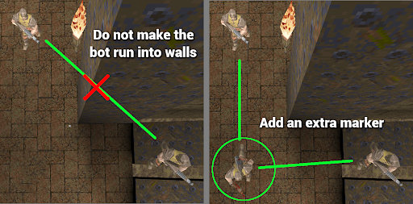
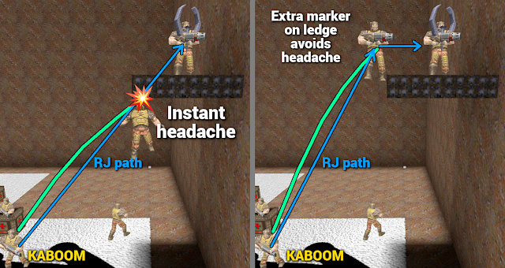
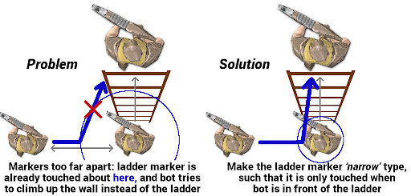

# Quake Frogbot Waypoint Tool v2

## TODO
- Add embedded waypoint instructions when scripts are ready


## About

The Quake Frogbot needs _waypoints_ to be able to run around in a map. The waypoints need to be generated for each map, currently this is a manual process (it should in theory be possible to automatically generate sensible waypoints from map geometry, but manual tweaking will always provide the best results).

The waypoint tool runs inside plain Quake game engines (not QuakeWorld) and allows to create and edit waypoints. It is based on the one that _Mick K_ provided in his [waypoint guide](https://mickkn.mooo.com/quakeworld/frogbot/) (which may or may not be available anymore). It is built from the same source code as the Frogbot, but then with UI code added and some unneeded bits removed.  
The original UI source code is long lost or at least not easily found, hence it was reconstructed by DrLex through decompiling, and then enhanced for greater usability.

Once waypoints have been created, there are 2 ways to allow Frogbots to use them:

1. Recompile the Frogbot `qwprogs.dat` with the waypoint data included. This was the only way of doing it before DrLex implemented the next method in 2025 (hey, better late than never…)
2. Embed the waypoint data in a map BSP file. The information is stored as fields attached to entities, these fields all have a `FrB_` prefix. A script ~~is~~ will be provided that supports injecting the data into a `.map` or `.ent` file. This means this method can be used to build a BSP file with built-in waypoints, or provide them as a separate file for engines that support `.ent` files.

Whatever method is used, the most practical way of producing waypoint data is with this waypoint tool.  
(One could manually set up the `FrB_` fields in an editor like TrenchBroom, but that would be very time-consuming and error-prone. It would only be OK for making simple changes.)

## Deploying and Building

In this directory you will find a prebuilt `progs.dat`, and an `autoexec.cfg` that sets up similar key bindings as used in Mick's guide. Put both inside a `waypoint` subdirectory of your favourite Quake engine. I use _vkQuake,_ but any engine that can run the single player campaign should work.

If you're going to make new waypoints for Quake maps, currently it will be essential to rebuild the waypoint tool with your work-in-progress waypoint data included, as explained below. (When the `.ent` injection script is available, this will no longer be required.)  
The waypoint tool is built from the same source code as the regular Frogbot, by enabling different options. To rebuild it with _fteqcc_ from within the `src` directory:
```bash
fteqcc.bin -DWAYPOINT_BUILD=1 -O3 -srcfile progs-waypoint.src
```

Important: the regular build of this tool requires a Quake engine that supports the `stof()` function (#81). Most modern engines like QuakeSpasm or vkQuake are OK. (If you badly want to run this in the original Quake, it is possible by rebuilding the tool with the `VANILLA_QUAKE` macro defined, but this will break the loading of BSP-embedded waypoint data).

## Editing Existing Waypoints

One of the motivations for resurrecting the source code of the waypoint tool, is to allow loading existing waypoint data for a map, such that one can simply continue editing from where one left off. If the tool is built with the waypoint code for that map included, or the map contains embedded waypoints, then they will be loaded together with the map when executing the `map <mapname>` command.

Saving work-in-progress, testing it with bots, and then continuing to edit, is the **only** sane workflow to make good waypoints for any map larger than a trivial 1-on-1. Making good waypoints for a larger map can take _days._ Trying to do it in a single session and hoping nothing crashes, and hoping it will be perfect from the first time, is _insane._

One can use the same 2 methods as described above to resume editing existing waypoints for a map:

1. Rebuild the waypoint tool with your latest waypoint code added to the `maps` directory.
2. (Available soon-ish) Inject the waypoints into the `.map` file and rebuild the BSP, or, if the Quake engine you're using supports `.ent` files, inject the waypoints into such file.

Recompiling the tool or using an `.ent` file are the easiest methods. Building waypoints into a BSP should be kept as final step when both the map and waypoints are ready for release.


# Waypoint Creating and Editing Guide

This is an evolved version of Mick's guide, which should now be considered obsolete, although it was a great starting point without which all this stuff would never have existed.

If you want to create waypoints for a map, I advise to first get familiar with that map. Ideally, play the map with human opponents, although you can also learn a lot by observing it being played.  
The nice thing about the waypoint tool though, is that _it runs inside Quake,_ and one can also explore maps in it, and try out jumps and such.

## How the Frogbot works, in a nutshell

The Frogbot relies on **markers** to navigate the map. Bots can only run or jump from one marker to another in (usually) a straight line. Markers are connected through _paths._ Each time a bot _touches_ a marker, it will select the best outgoing path to reach its current goal.

Markers are automatically generated for several entities in a map:
- deathmatch spawn points;
- weapons, ammo, health packs, armour, etc.;
- teleport triggers and destinations, doors, and platforms.

However, those alone don't suffice. _Extra markers_ must be added to guide the bots past corners, obstacles, etc. Then markers must be divided into **zones,** and the items that can be picked up must be given **goal** numbers to indicate (weak) preference. Last but not least, **connections** must be created between markers to tell the bot what paths can be followed, optionally with special descriptions for some of those connections.

A marker will be _touched_ when the bot comes sufficiently near it, and even if the bot did not plan to reach that marker, it will re-evaluate its trajectory whenever it touches any marker (unless in exclusive mode, as explained in the advanced section). This is important to remember: don't just assume bots will only run between markers that have connections between them. More details in the advanced section.

## Key bindings

These are the bindings provided by the `autoexec.cfg`. Of course you are free to modify them. Unless your memory is flawless, you will want to print out this list, or have it on a second monitor while running the waypoint tool.
```
KEY	ALTKEY	OLD_IMP	NEW_IMP	FUNCTION
O		120	131	TOGGLE MANUAL-MODE
MOUSE1	3	119	132	SPAWN A MARKER
G	9	132	142	DEFAULT MARKER-MODE
F	5	135	144	TOGGLE CLOSEST-MARKER-MODE
L	0	none	156	CYCLE BETWEEN 4 CLOSEST MARKERS
I	TAB	127	135	TOGGLE STATIC ACTIVE MARKER
P		128	136	REMOVE ACTIVE MARKER
H		129	137	DISABLE ACTIVE MARKER
J	6	130	138	TOGGLE ONEWAY-MODE
MOUSE2	4	131	139	TOGGLE CONNECT-MARKERS-MODE
K		none	160	AUTO CONNECT trigger_teleport
T		137	145	CLEAR ACTIVE MARKER PATHS
Y		138	146	MOVE ACTIVE MARKER
U		139	147	VERTICALLY MOVE ACTIVE MARKER
WHEELUP	2	140	148	INCREASE GOAL/ZONES
WHEELDN	1	141	149	DECREASE GOAL/ZONES
ENTER	Q	142	150	SET GOAL/ZONE
C	8	143	151	PRINT ZONE, GOAL, TYPE
R		none	157	PRINT/SHOW PATHS
V	7	144	152	CYCLE PATH-MODES or
				CYCLE MARKER TYPES
Z		146	154	CYCLE DISPLAY-MODE
B		145	153	DISPLAY TRAVELTIME
X		147	155	DISPLAY REACHABLE
N		125	133	CHECK ALL GOALS
M		126	134	CHECK ALL ZONES
,		none	161	SHOW SAME OR NEXT GOAL
E		none	159	MOVE TO ACTIVE MARKER
/		none	158	PRINT COORDINATES & EXTRA INFO
F1		133	143	DUMP WAYPOINT DATA
F2		?	130	NOCLIP
F3		?	50	DISABLE DAMAGE FLASH
F4		none	123	TOGGLE FROGBOT -- CAUTION!
				Read Advanced section first!
F5		-	-	CONDUMP COMMAND (dump console to file)
MOUSE3  	-	-	FIRE

PATH MODES
	- regular path mode (default)
	- disconnect-mode
	- jump ledge-mode
	- rocket jump mode
(new)	- slow precise jump mode
(new)	- precise jump mode
(new)	- slow down mode
(new)	- just GO mode
(new)	- focused path mode
	- dm6 door-mode
(new)	- exclusive door mode
	- reversible display-mode
	- water path display-mode
(new)	- clear all assigned path modes

MARKER TYPES (when DISPLAY-MODE = TYPE)
	- type mode off / clear marker type (default)
	- unreachable node
(new)	- exclusive node
(new)	- narrow node
(new)	- wait lift node
(new)	- slime island node
(new)	- want biosuit node
```

## The workflow

Ensure the map you want to create or edit waypoints for, is in your `id1/maps/` folder. Then Launch Quake. You may want to launch the engine with `-condebug` argument to automatically dump console output. Not essential, but provides a safeguard against unexpected crashes, although the new waypoint tool is more stable than the old one.

In the Quake console, type `game waypoint`. Then load the map with `map <mapname>`. Then you can start making waypoints as explained below.

After loading the map, it looks like you're in a regular Quake game with no opponents and everything made bright and low-contrast to better see what you're doing. To start editing waypoints, you must toggle **manual mode:** press `O`.


**Markers** are represented by the _Quake guy._ Inactive markers have the shotgun, the active marker wields the axe. Rotating markers indicate a relation to the current marker, depending on the current view mode. The default is to show markers to which the active marker has an outgoing path.

By default, the tool will activate markers in the same way as in the game, i.e., when you're close enough to pick up something or trigger an action. Usually, you will want to enable the tool's custom **Closest-Marker-Mode** with `F`. CMM makes it generally easier to select markers. When markers are really close to each other or overlap, CMM also allows to cycle between the 4 nearest with the `L` or `0` (zero) key.

### Useful keys for displaying info
- `Z` changes the display mode, which is useful to verify things. For instance path display mode (the default) will make all other markers spin that are part of the active marker's outgoing paths.
- `C` prints information about the active marker, like its number, zone, goal, and coordinates.
- `R` prints outgoing and incoming paths for the active marker, and visualises them through flying spikes.


### Steps
These steps do not need to be done in this exact order, but you will typically gradually move from the top to the bottom of this list as you progress.

1. Use the scroll wheel or keys `1` and `2` to select a **ZONE** number.  
   - **Zones** could be considered parts of the map where everything is within reach without having to cross obstacles or run a long distance. See the guidelines below.  
     Zone numbers do not impose a preference, I usually start with 1 for the “main” zone where most of the action will happen and go up from there, but you can use any number for any part of the map, and you can skip numbers.
   - There can be up to _32 markers_ in one zone. If you exceed this, you must split up zones.

2. Activate the desired marker and set its zone: `ENTER` or `Q`. Do this for all markers you consider the same zone.  
   
   - **Guidelines for assigning markers to zones:**
     1. going from one marker to another within the same zone _must not_ require passing through another zone's markers: moving between markers of the same zone must only involve following paths within the zone;
     2. markers within a zone must be within a reasonably short travel time, no more than a few seconds;
     3. do not create zones that are one elongated chain of markers, split those up into shorter chains;
     4. if going from marker _B_ to _A_ takes much longer than going from _A_ to _B,_ for instance _A→B_ is a simple jump, _B→A_ requires taking staircases, elevators, swimming, … then A and B must be in different zones;
     5. _doors_ should usually be treated as zone borders, and secret doors (that need to be shot to open) _must_ separate different zones (see advanced section).

3. Add extra markers where needed for constructing paths such that bots won't get stuck on geometry: move to the spot and `MOUSE1`. Do not overdo this, but don't leave huge gaps between markers either.  
   Remember to also assign a zone to the new markers. If a zone number is currently selected, new markers automatically get this zone.  
   

4. Assign **GOALS** to items: things the bot will want to fetch: weapons, ammo, health, powerups. Use the scroll wheel or keys `1` and `2` to select GOAL number and again use `ENTER` or `Q` on the marker.
   - The goal logic is horribly complicated and hard to understand; what follows is what I have learnt from experiments, Mick's guide, and digging in the source code. If someone has better insights, please update this guide.
   - The bot will have a very _weak_ preference for **lower** goal numbers, making their values more like _suggestions._ The bot has its own logic for preferring items, and only when there is ambiguity between the best scoring items, the one with the lower `G` number will win. For instance, the bot will desire to pick up Red Armour when available. If it is better to first pick up Yellow or even Green armour before chasing the RA, you should give the RA a very high goal (possibly even 24), and the other a very low goal, to tweak this preference. Other example: a Mega Health not easily accessible may require a very low goal number to make the bot want to fetch it. It depends on the map layout, and you may need to experiment a bit.
   - Mick recommends **not to reuse the lowest goal numbers,** and this seems generally good advice. I would add that one should especially not give the same low goal number to _different_ weapons or powerups, certainly not when they are in the same zone and absolutely not when they are directly linked. It _should_ be OK to give the same weapon the same goal across different zones, but I am not sure about this.
   - If health or same ammo items are clustered together with direct paths between each other, then **do** give them the same goal number. Also, the larger the cluster of same ammo or health, the more worthwhile it may be, hence may deserve a lower goal number than isolated items of the same kind (but again, goal number preference is weak anyway).
   - You will notice that the following items are given high default goals because they are considered less desirable. Of course you can give particular instances of these items (especially the weapons) a different goal if you want:
     * 19 `item_cells`
     * 20 `weapon_supernailgun`
     * 21 `weapon_supershotgun`
     * 22 `weapon_nailgun`
     * 23 `item_spikes`
     * 24 `item_shells`
   - To help with avoiding overlapping goals, the `,` key cycles between items that share the same goal number, when an item with assigned goal is active. Otherwise it prints the lowest unused goal number.
   - It is possible and valid to assign _no goal at all_ to items. This will _not_ make the bot totally ignore them and it may still pick them up when nearby, but it will generally not do any effort to reach the items. This is useful if for instance chasing a particular Quad or invisibility is too risky and makes the bot an easy target.

5. Go to another zone and repeat steps 1 to 5.

6. Use `N` and `M` to check whether you didn't forget to set zones and goals (enable NOCLIP for this, `F2`).
   - Using the `C` key on an active marker will show its zone and goal, and some more info.  
   - It is recommended to give everything a zone, even if it will not be used in a path. It is OK to omit goals as explained above.

   

7. **Connect markers:** each marker can have up to 8 outgoing paths the bot may choose from. Normally the tool will create 2-way (bidirectional) paths, unless you enable one-way mode with `J`. Remember that you can use the `R` key to display paths for an active marker.  
   To add a path from marker _x_ to _y_ (and vice versa unless one-way mode):
   - Start at _x_, optionally press `G` to reset marker mode, then `MOUSE2` for Connect Marker Mode.
   - The next marker you touch will be linked. If there is any risk of activating the wrong marker on the way, first press `MOUSE2` again to temporarily disable CMM.
   - Move to marker _y_. If you didn't disable CMM, the link will be made instantly. Otherwise you again need to `MOUSE2`.
   - Once a path has been added, Connect Mode disables itself, but marker _x_ remains set as static active marker. You can then either make another path from _x_ to a different marker by moving to it and again using `MOUSE2`; or you can deselect _x_ by pressing `TAB` or `G`.
   - Avoid making paths _towards_ spawn points or one-way teleport destinations, use one-way mode to only go away from them, _because telefrag._
   - Ensure every marker that can be reached in any way (even if only by being flung around by an explosion), has at least one outgoing path, otherwise the bot may get stuck on it.
   - If you added a path by mistake, you can remove it with _disconnect mode,_ see below.  

   

8. **Teleports:** you must make a one-way connection from each `trigger_teleport` to its corresponding `info_teleport_destination`. (This has become a lot easier in the v2 tool.)
   - It is _essential_ to first enable both NOCLIP with `F2` and closest-marker mode with `F`.
   - Then move into the teleport trigger zone, and ensure with `C` that the `trigger_teleport` marker is selected.
   - Hit `K`. The trigger is now connected to its destination (and _only_ it destination, as it should be).  
     
   - If it is a 2-way teleporter, now do the same thing at the other side to connect its trigger to the destination.
   - Teleports are disabled in manual mode, hence toggle with `O` to get teleported to the other side.
   - It doesn't matter whether you assign a `trigger_teleport` the zone it is in, or its destination zone. (I stick with the zone it is in.)
   - A `trigger_teleport` must only have _incoming_ paths besides its single outgoing destination path (other outgoing paths would be pointless and could mess up path planning).  
     An `info_teleport_destination` of a _1-way teleporter_ must only have _outgoing_ paths besides its single incoming trigger path _(again… telefrag)._  
     For a _2-way teleporter_ however, if the destination marker(s) need to be traversed and will be touched when trying to reach the trigger at that end, then the destination marker must also have a path back to that trigger. But, never use destination markers as regular path markers if they are high up in the air and cannot be (easily) touched. Those must only have outgoing paths.

9. **Special path modes.** You can apply these while making the paths, or afterwards. The modes for a marker's paths can be seen by pressing the `R` key.  
   Same workflow as above, only now you also have to select the **mode** with `V` before making the connection (not all are path modes, some affect display mode). Most of these require _one-way mode_ to be enabled (`J` key).
   - **Disconnect mode**: removes a path, but even though this also works without enabling one-way mode, it will only disconnect the path from the starting marker _x_ to target _y_. Repeat in the other direction unless you really want to have a one-way path.
   - **Jump ledge** (shown as ‘`J`’, number 1024 in code) is to make the bot jump _up onto_ or _down from_ ledges. Paths going up a step taller than 18 units, must be marked with this mode to ensure the bot will jump onto the step. Mind that _slow precise jump_ mode may be more appropriate to get onto small ledges, and _just GO mode_ may be more appropriate for a downward path.
   - **Rocket jump mode** (shown as `‘R’`, number 512 in code) is to make the bot consider a RJ from that place to the destination. It will only do this if the conditions are right, and will also add a coin flip to the decision, so don't expect the bot to RJ all the time. See the advanced section below for some tips.
   - **Slow precise jump mode** (shown as `‘PS’`, number 2176 in code) is actually a combination of the next 2 modes, provided for convenience because most often you will need them together. This combined mode allows to _navigate small steps_ like the ones towards the yellow armour in `e1m2`. The bot _will not jump_ until it is within a distance of _48 units_ of the marker from which this `PS` path originates. This means you must place such markers close enough to the ledge on which the bot needs to jump, otherwise it will not jump at the right moment, and get stuck.  
     You may not need this often, but without it, getting onto certain small steps is often near impossible because the bot moves too erratically when trying to use ledge jump mode.  
     
   - **Precise jump mode** (shown as `‘P’`, number 128 in code) will make the bot do extra effort to initiate a jump closer from the location of the marker where this path originates, and also to better aim in the direction of the destination marker. This can be used for tricky jumps that require accuracy, because normal bot movement is rather _sloppy._  
     Again, the bot will only jump within a distance of 48 units of the start marker. To make this work well, provide a single path towards the jump spot in such a way that the bot is already moving roughly in the right direction when it reaches the marker from where to jump.
   - **Slow down mode** (shown as `‘S’`, number 2048 in code) will make the bot slow down while near the marker from which this path starts. It is mostly useful to combine with precise jump, but can also be used alone or in combination with just GO mode, to avoid that the bot overshoots its target when making a deep downward jump.
   - **Just GO mode** (shown as `'!'`, number 1 in code) does what it says: it disables all safety checks in the bot for that path, and just makes it _go._ The most common use case is to override the bot's fall-from-edges mechanism, which sometimes engages inadvertently and prevents the bot from jumping off a ledge. If you see the bot zig-zagging across an edge while it should just jump down, try adding this path mode.  
     A less common use case is to force the bot to traverse a short bit of lava, which it may otherwise refuse if there is no obvious spot to jump to.  
     In `lilith` you will find examples of both these cases at the 2 teleports in the map's corners.
   - **Focused path mode** (shown as `'F`, number 2 in code) makes the bot look at (focus on) the destination marker of the path. This is useful when walking along tricky thin ledges (example in `monsoon`), or when the bot needs to jump out of water (example in `cmt4`). Without this mode, the bot may be distracted by looking at the next item it wants to pick up, causing it to move inaccurately and fall off the ledge, or face the wrong way to perform the water jump. (Looking at enemies always has priority over this path mode.)
   - **DM6 door mode** (shown as `‘D’`, number 256 in code) is for getting through doors like in _dm6_ that need to be shot/whacked to open. This is limited by certain constraints and requires extra configuration. More details in the advanced section below.
   - **Exclusive door** (shown as `‘E’`, number 128 in code) is a _pseudo path_ mode that must point from an exclusive marker to a door or platform. See the advanced section for more info.

The path mode selection also affects the display of markers connected to the active marker: when a certain mode is selected, only markers connected through an outgoing path of that type will be shown spinning. (The selection contains 2 pure `display-modes` for certain auto-assigned path types, these cannot be set.)

At regular moments, and especially when you're done, use `F1` to dump the waypoint code to console. If you didn't run with `-condebug`, you must then use `condump` to write the console log to a file. The `autoexec` binds this to `F5` (think QuickSave).

### General Remarks
- Guideline 1 for assigning markers to zones is really important; if violated, path planning may not work as expected. For instance, if `m42` is in `Z1` and `m43` is in `Z2`, and you want to add a marker that is _only_ connected to `m43`, not to `m42` nor any other `Z1` marker, then this new marker _must_ be in `Z2`, _not_ in `Z1`.  
  
- Although _Closest Marker Mode_ (`F` key) makes it easier to select markers, you should disable it from time to time to ensure you are not creating paths towards markers that cannot be touched in the actual game. If a marker is floating up in the air, which is often the case for teleport destinations, check whether it activates when approaching it while CMM is disabled. If not (immediately), do not create paths towards it. (You may and probably should create outgoing paths, just in case the marker does get activated.)
- Remember that bots will react to _any_ marker they ‘touch,’ not only the next one on their path (unless they are in exclusive mode).  
  Also, the touch mechanism is pretty _coarse._ When running between 2 markers that are not extremely far away from each other, the target marker will usually already be touched at the half-way point. The bot will then stop moving towards that marker and change its direction towards the next planned marker. This can make it seem as if the bot is cutting corners on paths with sharp angles. When it is important for the bot to follow a specific curve, you may need to place extra markers, or move markers farther away from obstacles to keep the bot from bumping into them.
- You can ‘lock’ the active marker in Static Marker mode with `I` or `TAB`, allowing to move to other markers without activating them. It is also useful to watch the paths animation (`R`) from a distance, or check how far you are from the marker with the `/` key.
- It helps to draw a floor plan of the map with zones, goals and paths, especially for complicated cases like exclusive paths, although the visualisation modes of the tool make it easy to spot mistakes. It also is interesting to walk around in existing maps and see how waypoints were added.
- At any time when you are confused about what marker mode you're in, press `G` to reset. (The only thing this does not reset, is closest marker mode.)
- Moving an existing marker is preferable over deleting it and making a new one. Static marker mode (`I` or `TAB`) is your friend here.
- Paths through _push zones_ must be _one-way_ for obvious reasons. The old Frogbot did not create markers for push brushes, but the v2 Frogbot does. Some maps have push zones consisting of multiple segments, meaning there will be multiple markers. In that case you should not connect all those markers, it suffices to make a path to the first `trigger_push` marker, and then a path from that marker to the exit. Any `trigger_push` markers on the way can be left unconnected and should be given `untouchable` marker type. See `aerowalk` for an example.
- Vertically moving markers (`U`) can also be used on `func_button`, `teleport_trigger`, `trigger_push`, and `door` markers, but not on other non-manually created markers like weapons.
- It is possible to apply multiple modes to a path, but some combinations make no sense.
- The Frogbot can exploit Quake engine tricks like real players (strafe + turn) to change direction while in the air. This means you may create jumps that rely on such tricks, but make sure to verify they work with an acceptable success rate.
- I don't really know the purpose of the _‘display reachable’_ tool. It requires static active marker mode (`I` or `TAB`), and will try to trace a path towards the first marker you're ‘touching’ after activating this mode. It will fail if there is an obstacle, or the distance is “too far,” whatever that means.  
  It has nothing to do with unreachable marker flag (see advanced section).  
  Although markers can be placed further apart than what this tool considers too far, it is still a good guideline for maximum marker distance.
- Same for the _runaway_ thing: I don't know what it's for. The information printed on the second and third lines when pressing `C` is related to this ‘runaway’ concept, and the markers shown in runaway mode are the same ones listed in those lines. This appears to be an unfinished feature, there is some logic in the code to do something special when the bot is in `RUNAWAY` state, but _nothing_ in the code sets this state. I might look into this someday… If anyone knows more about it, please explain!
- Markers have an _index:_ the index for `m123` is 123. Lower indices are used by map entities. In previous editions of the Frogbot, indices for custom markers could change when loading existing waypoints and then saving them, even when making no changes at all. The v2 waypoint tool has a deterministic way of saving waypoint data and will not only preserve existing indices, it also saves waypoint code in a standard ordering to make it much easier to track changes. (When importing waypoints from an older version, data will be reordered, but indices will stay the same.)
- Goal assignments will be omitted from waypoint data if they do not deviate from the default. Therefore you will never see `G23(m42)` in the waypoint dump if `m42` is a box of spikes.

### Troubleshooting
- If you notice the bot going nowhere, randomly moving around while looking at the ceiling or floor, most likely a nearby marker has an invalid path going towards a marker in another room. Check paths with the `R` key, and delete invalid paths in both directions if they go through walls, ceilings or floors.
  - Another possibility is that a zone is too large or scattered. Ensure zones consist of markers clustered together, and that each marker within a zone can be reached from every other marker in that zone without having to exit the zone.
- If the bot keeps _‘orbiting’_ around a marker, most likely it is waiting in vain for the marker to be touched. Usually these are markers that float up in the air, like teleport destinations or spawn points. Do not make paths towards such untouchable markers. Only give these outgoing paths for the cases where they do get touched, (of course a teleport destination also needs an incoming path from its teleport trigger).


## Adding your waypoint data to Frogbots and/or waypoint build

Again, use `F1` to dump the waypoint code to the console, and unless you launched Quake with `-condebug`, then use `F5` to save the console to a file. So, now you have this dump of waypoint code. What to do with it?

As stated above, you do not need to wait until the whole map is done. You can already test your first zones, although you may need to keep spawning new bots while others get stuck in unfinished areas.

The code that is spammed to the console when pressing `F1`, is actual QuakeC code that either needs to be added to the Frogbot source and then compiled, or converted into entity fields injected into a `.map` oor `.ent` file to embed the waypoint data in it.

Find your console dump file (often called `condump.txt`) and extract the entire `void() map_mapname {…};` function from the end. Save this to a file called `map_mapname.qc`. The `mapname` must be all lowercase and correspond exactly to the actual map name that is also used for the `map` command.

For the shell freaks, this bit of magic will extract the last waypoint code from the dump:
```bash
awk '/void\(\) map_.* =/ {found=NR} END {if (found) for (i=found; i<=NR; i++) print lines[i]} {lines[NR]=$0}' condump.txt
```
Ensure no unwanted newlines are introduced in the code: lines must _only_ be split after a `;`.  
You _can_ manually edit the waypoint code, like adding a goal or path mode you forgot, removing unwanted paths or path modes, or fixing other things. The format is straightforward.

### Method 1: build waypoints into Frogbot progs

This is the classic method and is required for maps you cannot rebuild yourself (actually not, it will also be possible to use an `.ent` file when embedded waypoints are fully implemented—TODO).

Add the `map_mapname.qc` file to the `maps` folder of the Frogbot source code, then run the `generate_maplist.py` script with arguments `-vlg` to update the `maplist.txt` file and routines in the source code. Then build the Frogbot `qwprogs.dat`, deploy it, and you can test your waypoints in a QW supporting engine like ezQuake.

To resume editing your waypoints, rebuild the waypoint tool `progs.dat` and deploy it, then load the map again.  

If you want to include waypoints for a certain map in this repository, create a pull request.

### Method 2: embed waypoints into a `.map` or `.ent` file

**TODO.**

…

Once you have imported waypoint annotations into a `.map` file, you can safely edit the map because the annotations rely on IDs attached to entities. Only when you delete an entity, you will need to remove the `FrB_P*` annotations from other entities that referred to the deleted ID. (TODO: allow doing this automatically with the script.) The map can then be rebuilt and the BSP can be loaded in the waypoint tool, allowing to add zones, goals and paths to any newly added entities. In general however, it is recommended to wait with embedding waypoints in the map until it is considered final.

…

Converting embedded waypoints back to QuakeC code format is simple: load the map in the waypoint tool, and dump the code with `F1` as usual.


## Advanced

### Unreachable and untouchable markers

This is optional, but can prevent the bot from doing certain dumb things. Markers can be flagged as being _unreachable,_ which means the bot should avoid getting near them. Bots will avoid making jumps that end up near an unreachable marker. The bot will also totally ignore items flagged as unreachable, no matter how juicy they may seem.

To set a marker as unreachable: set display mode `Z` to “Display type,” and use `V` to select `unreachable node`. Then activate the marker and right-click (`MOUSE2`).

If there are lava or slime pits, or deadly traps, it may be a good idea to place some unreachable markers in them. Look at `dm4`, `start`, or `tox` for examples. The markers should have some zone number, but do not need to have paths. If however there is a way out of the trap, by all means add an exit route.

There is also an _untouchable_ marker type. When set, the marker will never produce a touch event. As mentioned above, it is recommended to set this on intermediate `trigger_push` markers. It can also be used on markers that overlap with other markers and are redundant. For instance if an `info_player_deathmatch` is on top of an item marker, it makes sense to just disable the spawn marker and use the item for paths.  
_Be careful:_ an untouchable marker must never have incoming paths, or the bot may orbit around it waiting for a touch that never comes. (It makes no sense either to give it outgoing paths, but that is merely pointless instead of dangerous). Errors will be printed in the `MarkerInfo` section of the waypoint dump when paths towards untouchable markers are detected.  
The waypoint tool will also ignore untouchable markers unless closest-marker-mode (`F`) is active. This helps to connect paths to the other overlapping marker (and makes it more obvious when a marker is untouchable).


### Lifts/elevators with or without buttons

**Automatic lifts/platforms** that go up as soon as a player walks on them, are simple to set up: connect markers to the platform, and then connect the platform marker to the destination. Often the latter should be a one-way path, if there is no easy way to jump down from the raised platform.

By default, the bot will not go towards such platforms when they are not in their ‘down’ position, and may try to find another path. If you want the bot to always wait for the platform if it is the best path to take, or you notice that the bot often gets crushed under the platform while in vain trying to find an alternative path, set `wait lift` marker mode on the platform marker. To do this, set display mode `Z` to “Display type,” and use `V` to select `wait lift node`. Then activate the marker and right-click (`MOUSE2`).

The `wait lift` mode will make the bot wait at any marker that has a path towards the platform, if the platform is the most desirable path, but is not in the downmost position. If this is not desirable for a specific path, set `just GO` mode on the path, and the bot will ignore any dangers as usual. Also, make sure that the waiting spots are sufficiently far away from the platform, or the bot may still get _juiced._

Note that all door-and-lift-like things are treated *equal.* There may be cases where the bot has to walk towards a door that will open automatically, but the test for platform-like things not being in the downmost position causes the bot to refuse to walk towards this door. The solution here is to set `just GO` mode on that path. An example can be found in the map `skull`.

Maps often feature lifts that require a **button press.** This is a bit more complicated to set up, make sure to look at the illustration:
1. make _one-way_ path(s) from outside the lift (_mIn_ in the image) directly to the button (_mBtn_ in the image; do _not_ link to the platform);
2. then make a one-way path from the button to the platform marker (_mPlat_);
3. then make one-way path(s) from the platform to the destination(s) (_mDest_).
4. if `wait lift` mode is required, it must be set on the **button marker,** not on the platform. In most cases this should be done for this type of lift, because there is no default avoidance logic at all for these.


The image shows optional extra paths in dotted lines: you may want to allow the bot to jump down the ‘elevator shaft’ by making the path between platform and destination 2-way, and provide an extra 1-way path from the platform to outside.

_Multi-floor_ elevators are possible when providing paths from the platform to multiple markers, although whether the bot will actually be able to get off at intermediate floors, may depend on map design. See the `oktest` map for an example of a multi-floor elevator (the bot will jump off half-way through if it wants the mega-health).

Remember that selecting platform and button markers will only be feasible in closest-marker mode (`F`), possibly with `NOCLIP` enabled (`F2`). Double-check that you connected what you intended.


### Exclusive Markers

There may be situations where you want the bot to focus on exclusively following a specific path. For instance, after touching a _switch_ to open a door, the bot has to run from the switch to the door while ignoring any markers not part of this path. The bot must also not react to touching any marker on this path towards the door _unless_ when coming from the switch.  
An essential part of making the bot push the switch to open the door, is ensuring that the only path going to the door is a _one-way path_ via the switch. If the path from the switch to the door is well-separated from other paths, this is all that is required. Making a path through a switch, means the bot must push the switch before moving to the next marker in the path.


In a map like `dm5` however, this does not suffice because the paths going to and coming from the switch share the same narrow bridge. Normal bot behaviour is to re-evaluate paths each time a marker is touched. If we would simply create a loop with 2 one-way paths, then when running towards the switch and touching a marker on the return path, the only allowed path is back and vice versa. In other words, the bot would keep yo-yoing between markers from both paths, and go nowhere.  
Also, if the door is already open, we don't want the bot to make the detour via the switch.

The v2 Frogbot offers a solution for this scenario, consisting of 2 parts:
1. **Exclusive node** marker type.  
   Set this on the markers of the one-way path going from the switch to the door. As with the other node types, set display mode `Z` to “Display type,” and use `V` to select `exclusive node`. Then activate the marker and right-click (`MOUSE2`).
2. **Exclusive door** pseudo-path mode.  
   Connect an `exclusive door` path between the exclusive markers nearest to the door, towards (one of) the door's marker(s). As often, `NOCLIP` and closest marker mode are your friends here because the door marker will likely be inside a wall. Only do this for the exclusive markers closest to the door—if the bot is near the switch anyway, it is better to again push it.

This works as follows. The bot will:
- ignore touching an `exclusive node` marker, _unless:_
  - when coming from another marker, following a path that has this exclusive node as its destination;
  - when this node has an `exclusive door` pseudo-path towards a door marker, and that door is currently open;
- ignore _all_ other markers except the `exclusive node` as soon as it starts following a path towards this node. Because of risk of forever getting stuck, there is a deadline of _2.5 seconds_ to reach the exclusive node, the bot will resume its usual business if this deadline expires.

When the bot exits an exclusive path, in other words when it decides to move from an exclusive marker towards a non-exclusive marker, the `exclusive door` mechanism is instantly suppressed for 4 seconds, to allow the bot to exit through the same door without being forced back in.


If you look at the `dm5` waypoints or the above diagram, you will notice that 2 extra exclusive markers with paths towards the door have been placed to make bots approaching from other directions immediately go through the door when someone else has opened it for them. Same for `ultrav`.  
This is a complicated thing to set up, and it must be double-checked and tested for mistakes, but the end result is well worth it. It helps a lot to draw a diagram of the markers and how they must be set up, as in the example above.

Mind that a _platform_ is also considered a _door,_ considered ‘open’ in its ‘up’ position, which means that an exclusive marker can also be linked to a platform with _exclusive door_ mode to activate the marker only when the platform is up. This could for instance be used to make the bot move away from under an extended platform, although the `wait lift` mechanism should suffice for this.


### Reliable rocket jumps

The v2 Frogbot has _3_ rocket jump modes:
1. The **regular** RJ mode requires the bot to be running towards the launch spot, and it will then launch a rocket at its feet while jumping, when sufficiently close to the spot and more or less heading in the right direction. This is not very accurate, but it is _fast,_ which makes it the preferred mode when possible. Usually the bot is able to correct for errors through air turning tricks, but it will occasionally fail, which makes it all the more realistic.
2. When combining RJ with either slow down or precision jump path modes, the bot will follow a slower but much more **accurate** procedure. It will come to a halt and only launch itself when both at near-ideal position and angles, and will not try to correct mid-air. Only use these modes when truly needed, because the chance that the bot can execute them diminishes when there are more enemies that can distract the bot.  
   There are 2 variants:
   - **‘Mortar’** = `RJ` + `slow down` path modes combined, shown as `RS` in the path display. As the name implies, this will launch the bot like a mortar in a parabolic trajectory, optimising for maximum distance. This mode allows to reach the highest elevations, 240 units is about the maximum although 256 might be achieved in ideal circumstances, but don't count on it.
   - **‘Cannon’** = `RJ` + `precise jump` path modes combined, shown as `RP` in the path display. This will indeed launch the bot more like a cannon with direct aim towards the destination, compensating for vertical drop. This does not allow to go as far or high as the running or mortar jumps, but can be required for really tricky jumps where accuracy is essential or when a low ceiling does not allow for a full parabolic trajectory.

Bots at higher skill levels will be quicker and more accurate while preparing accurate rocket jumps.

Rocket jumps can be _tricky,_ especially when the destination is a ledge that sticks out. If you notice that bots often smack their head against the bottom of the ledge, it usually means the target marker is too deep into the ledge. In that case, it helps to move the marker, or place an extra marker just on the edge of the ledge, perhaps even slightly above it, to improve the bot's aim. Only make that marker the destination for the rocket jump path, and give it a path to the actual destination on the ledge.



For the regular running RJ type: when possible, try to provide only 1 incoming path into the marker from where such RJ should happen, in more or less the correct direction for the jump. This is not essential, but can help with accuracy and reliability of the jumps.

Even when their extra accuracy is not needed, the _mortar_ and _cannon_ modes have the advantage that the bot will come to a halt and be standing on solid ground. This makes these jumps a solution when they have to be performed on a staircase or similar structure, where players will actually be prevented from instantly jumping while moving because they are in a ‘falling’ state most of the time. An example is the jump towards the red armour in `aerowalk`.

Mind that there are subtle differences between Quake and QuakeWorld physics, which can cause a jump that works in one engine to fail in the other. Do not create set-ups that are borderline, and verify that the jumps do work in the intended engine.

Bots will only actively plan an RJ when that path is worth following to reach a goal, and there is no alternative path that does not require RJ, even if much longer. In the latter case they might still randomly decide to take an RJ shortcut when happening to pass across the marker, but they will not actively seek out that path.


### Water

The Frogbot uses different logic to navigate underwater due to the ability to move in 3 dimensions. There are additional checks on reachability of destinations. Make sure that connected markers are within visible range and are not obscured by corners or other obstacles. There is robustness against minor obstacles, but don't expect the bot to find its way through a maze with sparsely provided waypoints.


### Slime

With the old Frogbot, making paths through _slime_ was a no-go. Unaware of the danger, the bots would happily swim in the slime and get killed. The v2 Frogbot is smarter and will avoid paths through slime, but _only_ if the map contains a biosuit or invulnerability power-up. If a bot then picks up one of those items, the slime paths will be treated like normal paths and the bot may traverse the slime to reach something worthwhile.  
Therefore:
- in maps with a biosuit and/or pentagram of protection, it is OK to create paths through slime if it makes any sense;
- in maps that do not have those items, do not create paths through slime unless they're very short.

There are 2 new _marker types_ related to this feature, that can be assigned by changing display mode to `type` with the `Z` key, then selecting the mode with the `V` key, and right-clicking the marker:
1. **slime island:** if there are markers on dry zones or islands that can only be _exited_ through slime, it is important to set this type on all markers on that ‘island.’ This will allow the bot to consider jumping into the slime even when its protection has run out; otherwise it would become a sitting duck on the island.  
If there are _teleport triggers_ or _destinations_ in slime, or that will drop the player into slime, you _must_ also mark these as `slime island` for the path calculations to work correctly, because the game is unable to reliably detect that such markers are inside slime.  
Display mode can be set to `biohazard` with the `Z` key to see which markers are currently considered to be inside slime, or have been given a `slime island` flag. This can be helpful to see whether you still need to set this flag on certain markers.
2. **want biosuit:** this should be set on every worthwhile item that requires the biosuit to be safely reached. This will make the suit as desirable to the bot as the most desirable item marked as such. If there is no marker of this type, the suit will have zero desirability and the bot will only pick it up by chance.

When making _zones,_ give markers in slime their own zone(s). Do not mix ‘dry’ markers and slime (island) markers in a single zone.

Look at `efdm13` for an example.

Never make any paths going into _lava,_ even though theoretically they could be traversed with invulnerability. The extra complexity required to also implement this, was not deemed worth it. Maps where it would be useful are scarce, and the consequences of the power-up expiring while still in lava are usually _lethal._ Be aware that some maps have lava that looks like slime—if it kills you within seconds, it is lava.


### Ladders, narrow markers

Some maps simulate _ladders_ by means of what is basically the steepest possible staircase in a Quake map, with extremely thin steps, typically only 1 unit deep. The old Frogbot was unable to ascend these, but this has been fixed in v2. It should suffice to place one marker at the bottom of the ‘ladder’, one at the top, connect them, and the bot will climb up the ladder like a human player. (This may still fail if the map does not adhere to the best practice of using integer coordinates for all vertices.)

If the bot can approach the ladder from its sides, placing a single normal marker in front of it will be problematic. Due to the coarseness of the touch mechanism, the marker may already be touched long before the bot is in front of the ladder. The bot will then already try to aim for the top of the ladder, fruitlessly attempting to climb up the wall.

The most practical solution in cases like these where markers must only be touched when the bot is almost on top of them, is to assign `narrow` marker mode. This mode causes the marker to only be touched when the bot is within 24 units distance. As usual, set display mode to `type` with the `Z` key, then select this mode with the `V` key, and right-click the marker.



If even this would not suffice, you could place extra markers to ‘shield’ the marker from being prematurely touched.

`Narrow` markers are not only useful for ladders, they can also help to guide the bot through narrow openings or ensure it is in the right position to start walking across a narrow beam.


### Dealing with overlapping markers

Some maps have markers at the exact same coordinates. I consider this _bad practice_ (even though one of the most iconic Quake maps suffers from this) and it should be avoided, but how to deal with it when it's in an existing map?
- By enabling closest-marker-mode (`F`), you can select between overlapping markers with the `L` or `0` (zero) key to cycle between the 4 most nearby markers. Print marker info with `C` to see what marker you have actually selected.
- In general, _you should not make a path between overlapping markers._ Although the v2 Frogbot has some protections against this, connecting such markers may cause the bot to get temporarily stuck. It makes no sense anyway, there is no path to follow between things at the same coordinates. Just connect both markers to neighbouring markers in the same way (unless one is a spawn, then it should only have outgoing paths).
- The same goes for markers that do not exactly overlap, but are still very close to each other. If you notice bots getting stuck or yo-yoing between such markers, try removing the connections between them and give them the same incoming and outgoing paths.


### Setting up a shootable door
This is for doors like the one in `dm6`. Originally, the Frogbot source had everything hard-coded for this level, it was the only door the bots could handle. This has been extended by _DrLex_ to allow other doors, also vertical ones like the bookcase in `hohoho2`. (For historical reasons, the `dm6_door` name was kept in the source code and the tool.)

This only works under certain conditions:
- Bots can only handle _one such door per map._ If a map has multiple, you will have to pick the most desirable one. Do not create paths through other doors that do not automatically open when approached, or the bot will get stuck.
- The bot will only want to open the door if there is something desirable behind it. This also means the bot can only go through the door in that direction.
- The marker in front of the door and the desirable item _must_ be in a different zone. (If you have not yet created zones, assign _zone 1_ behind the door, it makes things easier.)

This may require loading at least partial waypoint data into the waypoint tool, because if the door is too different from the one in `dm6`, you will need to manually add some values to your waypoint code and then rebuild the tool.

#### Workflow
1. Assign `dm6 door` mode to the path that goes from outside to beyond the door. Enable _one-way mode,_ and select `dm6 door mode` with `V`. There must be no path in the other direction.  
   You may now want to dump the code with `F1`.

2. Find the **entity** of the door. It will have a marker standing _on top_ of it, which means that for vertical doors, it will likely be inside a wall. (In that case it may be good to use `U` to move the marker to the middle of the door, although it will usually work as-is.)  
   Enable NOCLIP (`F2`) and closest-marker (`F`) to easily select the marker. Then, use `C` to print the marker number. In this example, assume it is `m42`. Then, add at the end of the dumped waypoint code, before the closing “`};`”:
   ```
   dm6_door=m42;
   ```
3. Find the **zone number** of the thing behind the door, which the bot will want to obtain, for instance a mega health. If you haven't started assigning zones yet, or it is easy to change them, by all means use zone 1 for this area, because it's the default and then you can skip the following step. As noted above, it is _essential_ that the zone behind the door differs from the zone from which the bot will be shooting the door.

4. If the zone behind the door is not 1, for instance 7 in this example, you must add another piece of code before the closing “`};`”:
   ```
   door_targetZ=7;
   ```
5. Now comes the _trickiest part:_ bots need to know when the door is **sufficiently open.** By default, this is when the door has moved _67 units_ from its closed position. For doors similar in size and design as the one in `dm6`, this default will work fine.  
If the door is much smaller or larger, or moves differently, you will need to override the `door_open_dist` parameter. You could guess, but if you rebuild the waypoint tool with the above parameters added to your waypoint code, you can actually measure inside the tool how far the door has moved.  
To do this, disable Manual Mode (`O`), shoot the door (`MOUSE3` = scroll wheel button), quickly re-enable MM, and press `/` when you think the door is sufficiently open to walk through. (Smaller doors usually need to be open all the way.)  
You should then see something like “`dm6_door dist 48.7`.” Round down the number (48 in this example), and add before the closing “`};`”:
   ```
   door_open_dist=48;
   ```

As you can see, pretty complicated, but having bots open these doors and obtain the precious item behind it, makes them more realistic and challenging. Look at `hohoho2` for a full example of all the above.

(Nerdy detail: the lower the zone number you use for the thing behind the door (ideally 1), the more efficient the program will run. But unless you want to run the bots on an ancient machine, this doesn't matter at all of course.)

(It should be possible to simplify this whole system because it is overly complicated and needlessly constrained. The bot should simply shoot at doors (or secret switches that open doors) whenever it wants to go through them while the door is closed. There is no need to tie this to specific items or zones.)


### Become a Frogbot
Last but not least, you may have noticed the `F4` key which is bound to `TOGGLE FROGBOT`, and it does exactly that. Not only is this very cool because you can actually look through the eyes of a bot, it is also _tremendously useful_ to test how the bot will behave from a certain starting point and configuration in the map. Mistakes in waypoints can be easily spotted by enabling this and watching the bot do its thing.

There are a few **rules** though:

1. Paths must have been calculated, which currently only happens upon loading the map. In other words:
   - this will only work on previously compiled waypoints;
   - adding or deleting markers or paths, and then activating this, is **a guarantee for crashing the game,** and you will **lose your work** unless you saved it — _you have been warned._  
     (I might at some point provide a way to trigger recomputing of paths, but this is not trivial.)
2. Small changes like adding or removing modes to existing paths, or nudging the position of markers, are safe and can be tested on-the-fly. Changing marker types may not always have an effect.  
   It is _always_ best to dump your changes, rebuild, and reload, before testing them with this feature.
3. You should not be in manual mode, the bot will act like a drunken madman otherwise. You should not be in `NOCLIP` mode either.
4. There are differences between the bot running in Quake and in QuakeWorld engines. They are not huge, but especially jumps can be different. What works well in the waypoint tool might not work well in QW, and vice versa. You should still test your waypoints thoroughly in a QW engine.

You can test rocket jumps if you first pick up the prerequisites (obviously, a RL and rockets, but also enough health and armour). The random factor for RJs is disabled in the waypoint tool, and the bot will always want to RJ, unless this has been toggled off with `impulse 162`.

The movement of the bot can be influenced in a limited way by pressing movement keys, this may be useful to force the bot to make a mistake and see if it recovers.

If you want to live dangerously and test changes on-the-fly, make it a reflex to first dump your waypoint data to the console and then a file (`F1`, `F5`) before pressing `F4`.
